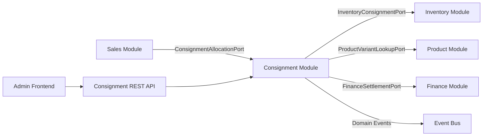
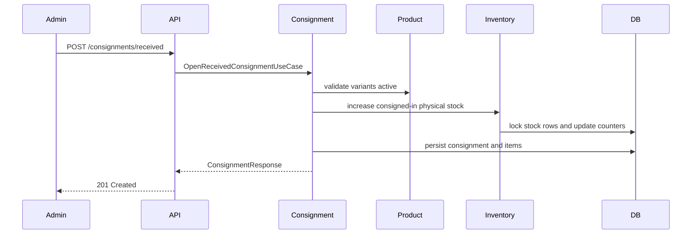
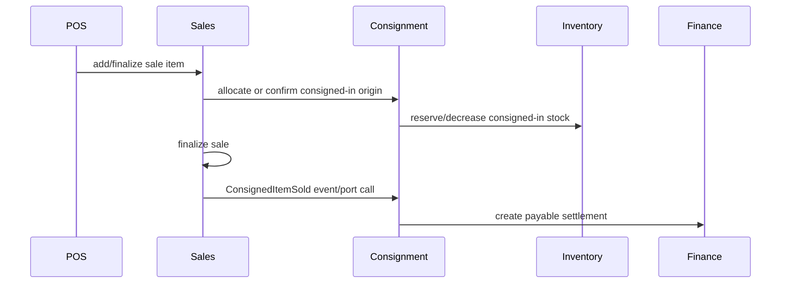

# Design Document: Consignment Management

## Overview

Consignment management is implemented as a new business module in the modular monolith. It owns the consignment lifecycle and coordinates stock-origin movements, sales effects, and financial settlements through ports and domain events.

The module must not be hidden inside Inventory. Inventory records physical and origin-specific stock effects; Consignment owns why those effects exist, who the external party is, how much remains pending, and what settlement is due.

## Architecture

### Module Layout

```text
modules/consignment
├── domain
│   ├── model
│   │   ├── ConsignmentAgreement
│   │   ├── ConsignmentItem
│   │   ├── ConsignmentSettlement
│   │   ├── ConsignmentType
│   │   ├── ConsignmentStatus
│   │   ├── SettlementStatus
│   │   └── StockAllocationPolicy
│   ├── port
│   │   ├── in
│   │   │   ├── OpenReceivedConsignmentUseCase
│   │   │   ├── OpenSentConsignmentUseCase
│   │   │   ├── ReturnReceivedConsignmentUseCase
│   │   │   ├── ReturnSentConsignmentUseCase
│   │   │   ├── PurchaseReceivedConsignmentUseCase
│   │   │   ├── ConfirmSentConsignmentSaleUseCase
│   │   │   ├── SettleConsignmentUseCase
│   │   │   ├── CloseConsignmentUseCase
│   │   │   └── SearchConsignmentsUseCase
│   │   └── out
│   │       ├── ConsignmentRepository
│   │       ├── ConsignmentSettlementRepository
│   │       ├── InventoryConsignmentPort
│   │       ├── ProductVariantLookupPort
│   │       ├── FinanceSettlementPort
│   │       └── DomainEventPublisher
│   └── service
│       └── ConsignmentSettlementPolicy
├── application
│   └── usecase
└── adapter
    ├── in
    │   └── web
    └── out
        ├── persistence
        ├── inventory
        ├── finance
        └── event
```

### Cross-Module Dependencies



Rules:

- Consignment domain must not import Spring, JPA, HTTP, Inventory implementation classes, Sales implementation classes, or Finance implementation classes.
- Cross-module calls go through ports or domain events.
- Inventory must remain authoritative for stock counters.
- Consignment must remain authoritative for consignment lifecycle and pending quantities.

## Domain Model

### ConsignmentAgreement

```java
class ConsignmentAgreement {
  Long id;
  UUID uuid;
  ConsignmentType type;        // RECEIVED, SENT
  ConsignmentStatus status;    // OPEN, PARTIALLY_SETTLED, FINALIZED, CANCELLED
  UUID partyUuid;
  String partyNameSnapshot;
  Instant openedAt;
  LocalDate dueDate;
  String notes;
  List<ConsignmentItem> items;
}
```

Behavior:

- `addItem(...)`
- `markItemReturned(...)`
- `markItemSold(...)`
- `markItemPurchased(...)`
- `cancel(...)`
- `closeIfFullySettled()`
- `recalculateStatus()`

### ConsignmentItem

```java
class ConsignmentItem {
  Long id;
  UUID uuid;
  UUID variantUuid;
  String skuSnapshot;
  int quantity;
  int soldQuantity;
  int purchasedQuantity;
  int returnedQuantity;
  BigDecimal settlementValue;

  int pendingQuantity() {
    return quantity - soldQuantity - purchasedQuantity - returnedQuantity;
  }
}
```

Invariants:

- `quantity >= 1`
- `soldQuantity >= 0`
- `purchasedQuantity >= 0`
- `returnedQuantity >= 0`
- `pendingQuantity >= 0`

### ConsignmentSettlement

```java
class ConsignmentSettlement {
  Long id;
  UUID uuid;
  UUID consignmentUuid;
  UUID partyUuid;
  SettlementDirection direction; // PAYABLE, RECEIVABLE
  BigDecimal amount;
  SettlementStatus status;       // PENDING, PAID, RECEIVED, CANCELLED
  String idempotencyKey;
  Instant createdAt;
  Instant settledAt;
}
```

## Inventory Model Changes

Inventory needs origin-aware counters in addition to existing physical/reserved/available counters.

Recommended counters on `estoque_items`:

```text
owned_stock               integer not null default 0
consigned_in_stock        integer not null default 0
consigned_out_stock       integer not null default 0
reserved_owned_stock      integer not null default 0
reserved_consigned_stock  integer not null default 0
```

Derived values:

```text
physical_stock = owned_stock + consigned_in_stock
available_owned_stock = owned_stock - reserved_owned_stock
available_consigned_in_stock = consigned_in_stock - reserved_consigned_stock
available_stock = available_owned_stock + available_consigned_in_stock
```

Migration strategy:

1. Existing `physical_stock` values are migrated into `owned_stock`.
2. Existing `reserved_stock` values are migrated into `reserved_owned_stock`.
3. Existing API response may keep physical/reserved/available fields but add origin breakdown.
4. Database check constraints enforce all counters non-negative and derived consistency if stored derived columns remain.

## Database Schema

### Tables

```sql
consignments
  id BIGSERIAL PRIMARY KEY
  uuid UUID NOT NULL UNIQUE
  type VARCHAR(20) NOT NULL CHECK (type IN ('RECEIVED','SENT'))
  status VARCHAR(30) NOT NULL CHECK (status IN ('OPEN','PARTIALLY_SETTLED','FINALIZED','CANCELLED'))
  party_uuid UUID NOT NULL
  party_name_snapshot VARCHAR(255) NOT NULL
  opened_at TIMESTAMPTZ NOT NULL
  due_date DATE NULL
  notes VARCHAR(1000) NULL
  created_by UUID NOT NULL
  created_at TIMESTAMPTZ NOT NULL DEFAULT now()

consignment_items
  id BIGSERIAL PRIMARY KEY
  uuid UUID NOT NULL UNIQUE
  consignment_id BIGINT NOT NULL REFERENCES consignments(id)
  variant_uuid UUID NOT NULL
  sku_snapshot VARCHAR(50) NOT NULL
  quantity INTEGER NOT NULL CHECK (quantity >= 1)
  sold_quantity INTEGER NOT NULL DEFAULT 0 CHECK (sold_quantity >= 0)
  purchased_quantity INTEGER NOT NULL DEFAULT 0 CHECK (purchased_quantity >= 0)
  returned_quantity INTEGER NOT NULL DEFAULT 0 CHECK (returned_quantity >= 0)
  settlement_value NUMERIC(12,2) NULL
  CHECK (sold_quantity + purchased_quantity + returned_quantity <= quantity)

consignment_settlements
  id BIGSERIAL PRIMARY KEY
  uuid UUID NOT NULL UNIQUE
  consignment_uuid UUID NOT NULL
  party_uuid UUID NOT NULL
  direction VARCHAR(20) NOT NULL CHECK (direction IN ('PAYABLE','RECEIVABLE'))
  amount NUMERIC(12,2) NOT NULL CHECK (amount > 0)
  status VARCHAR(20) NOT NULL CHECK (status IN ('PENDING','PAID','RECEIVED','CANCELLED'))
  idempotency_key VARCHAR(120) NOT NULL UNIQUE
  created_at TIMESTAMPTZ NOT NULL DEFAULT now()
  settled_at TIMESTAMPTZ NULL

consignment_audit_log
  id BIGSERIAL PRIMARY KEY
  uuid UUID NOT NULL UNIQUE
  consignment_uuid UUID NOT NULL
  actor_uuid UUID NOT NULL
  action_type VARCHAR(60) NOT NULL
  payload JSONB NOT NULL
  occurred_at TIMESTAMPTZ NOT NULL DEFAULT now()
```

Indexes:

- `idx_consignments_type_status`
- `idx_consignments_party_uuid`
- `idx_consignments_due_date`
- `idx_consignment_items_variant_uuid`
- `idx_consignment_settlements_party_status`
- `idx_consignment_settlements_consignment_uuid`
- `idx_consignment_audit_consignment_uuid`

## REST API

Base path: `/api/v1/consignments`

| Method | Path | Description | Roles |
|--------|------|-------------|-------|
| POST | `/received` | Open received consignment | MANAGER, STOCK |
| POST | `/sent` | Open sent consignment | MANAGER, STOCK |
| GET | `/` | Search consignments | MANAGER, STOCK, FINANCE |
| GET | `/{uuid}` | Get detail | MANAGER, STOCK, FINANCE |
| POST | `/{uuid}/received-returns` | Return received consignment items | MANAGER, STOCK |
| POST | `/{uuid}/sent-returns` | Return sent consignment items | MANAGER, STOCK |
| POST | `/{uuid}/purchase` | Definitively purchase received items | MANAGER |
| POST | `/{uuid}/sent-sale-confirmations` | Confirm sent consignment sale | MANAGER |
| POST | `/{uuid}/settlements/{settlementUuid}/pay` | Mark payable settlement as paid | MANAGER, FINANCE |
| POST | `/{uuid}/settlements/{settlementUuid}/receive` | Mark receivable settlement as received | MANAGER, FINANCE |
| POST | `/{uuid}/close` | Close finalized consignment | MANAGER |
| POST | `/{uuid}/cancel` | Cancel unused consignment | MANAGER |
| GET | `/reports/due` | Due/overdue consignments | MANAGER, STOCK, FINANCE |
| GET | `/reports/settlements` | Pending settlements by party | MANAGER, FINANCE |

## Application Flows

### Received Consignment Opening



### Received Consignment Sale



### Sent Consignment Return

```mermaid
sequenceDiagram
    participant Admin
    participant Consignment
    participant Inventory

    Admin->>Consignment: return sent items
    Consignment->>Consignment: validate pending quantity
    Consignment->>Inventory: increase owned physical stock; decrease consigned-out
    Consignment-->>Admin: updated consignment
```

## Frontend Admin Design

Add `features/admin/consignments`.

Pages/components:

- `ConsignmentListPageComponent`
- `ConsignmentDetailPageComponent`
- `ReceivedConsignmentFormComponent`
- `SentConsignmentFormComponent`
- `ConsignmentItemTableComponent`
- `ConsignmentReturnDialogComponent`
- `ConsignmentPurchaseDialogComponent`
- `SentConsignmentSaleConfirmationDialogComponent`
- `ConsignmentSettlementPanelComponent`
- `ConsignmentReportsPageComponent`

Frontend ports:

```typescript
export abstract class ConsignmentPort {
  abstract openReceived(command: OpenReceivedConsignmentCommand): Observable<ConsignmentDetail>;
  abstract openSent(command: OpenSentConsignmentCommand): Observable<ConsignmentDetail>;
  abstract search(query: ConsignmentSearchQuery): Observable<Page<ConsignmentSummary>>;
  abstract getByUuid(uuid: string): Observable<ConsignmentDetail>;
  abstract returnReceived(uuid: string, command: ReturnConsignmentCommand): Observable<ConsignmentDetail>;
  abstract returnSent(uuid: string, command: ReturnConsignmentCommand): Observable<ConsignmentDetail>;
  abstract purchaseReceived(uuid: string, command: PurchaseConsignmentCommand): Observable<ConsignmentDetail>;
  abstract confirmSentSale(uuid: string, command: ConfirmSentSaleCommand): Observable<ConsignmentDetail>;
  abstract markSettlementPaid(uuid: string, settlementUuid: string): Observable<ConsignmentSettlement>;
  abstract markSettlementReceived(uuid: string, settlementUuid: string): Observable<ConsignmentSettlement>;
}
```

Menu integration:

- Add menu item `Consignacoes`.
- Visible to ROLE_MANAGER, ROLE_STOCK, ROLE_FINANCE.
- Mutating actions hidden by role but still enforced by backend.

## Domain Events

- `ConsignmentReceivedOpened`
- `ConsignmentSentOpened`
- `ConsignmentReceivedReturned`
- `ConsignmentSentReturned`
- `ConsignmentReceivedPurchased`
- `ConsignmentReceivedItemSold`
- `ConsignmentSentSaleConfirmed`
- `ConsignmentSettlementCreated`
- `ConsignmentFinalized`
- `ConsignmentCancelled`

Each event uses the existing `EventEnvelope` pattern with eventId, eventType, occurredAt, and payload.

## Correctness Properties

### Property 1: Pending quantity invariant

For any item and any sequence of valid sold/purchased/returned operations, `pending = quantity - sold - purchased - returned` and pending is never negative.

### Property 2: Received return round trip

For any received consignment quantity Q, opening then returning Q restores physical stock and consigned-in stock to their original values.

### Property 3: Sent return round trip

For any sent consignment quantity Q, opening then returning Q restores physical owned stock and consigned-out stock to their original values.

### Property 4: Received definitive purchase preserves physical stock

For any received consignment purchase quantity Q, owned stock increases by Q, consigned-in stock decreases by Q, and physical stock is unchanged.

### Property 5: Sent sale confirmation is idempotent

For any sent consignment sale confirmation with an idempotency key, repeated submissions create only one stock effect and one settlement effect.

### Property 6: Cannot close with pending quantities

For any consignment with at least one item pending quantity greater than zero, close/finalize must be rejected.

## Error Handling

| Scenario | Response |
|----------|----------|
| Invalid variant | HTTP 422 with variant UUID and message |
| Invalid quantity | HTTP 422 with allowed range |
| Insufficient owned stock for sent consignment | HTTP 422 with current available owned stock |
| Return greater than pending | HTTP 422 with pending quantity |
| Unauthorized role | HTTP 403 |
| Duplicate idempotency key with same operation | Return prior successful result or no-op success |
| Duplicate idempotency key with different payload | HTTP 409 |

## Security

- All endpoints authenticated.
- ROLE_MANAGER can do all actions.
- ROLE_STOCK can create and return physical consignments.
- ROLE_FINANCE can view and settle financial records.
- ROLE_CASHIER interacts only through PDV sale flows.
- Do not expose sensitive party data in logs.

## Open Decisions Before Implementation

1. Default stock allocation policy in PDV.
2. Settlement amount rule: fixed item cost, percentage, or manual.
3. Whether party should be backed by Supplier/Partner module in MVP.
4. Whether due date is informational or blocks actions.
5. Whether fiscal documents are out of scope for MVP; this design assumes yes.
