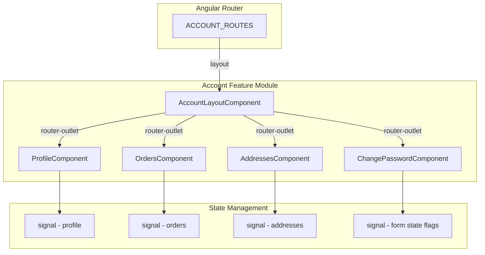

# Design: Área do Cliente (Minha Conta)

## Overview

The account area ("Minha Conta") provides authenticated customers with a self-service hub for managing personal data, viewing order history, managing delivery addresses, and changing their password. The feature is implemented as a set of standalone Angular components using signal-based state management, reactive forms, and OnPush change detection. A layout component provides consistent navigation (sidebar on desktop, horizontal tabs on mobile) with a `<router-outlet>` for child section content.

This design documents the existing implementation architecture, defines testable correctness properties for the pure logic within the feature, and establishes a testing strategy using Vitest and fast-check.

## Architecture



### Key Architectural Decisions

| Decision | Rationale |
|----------|-----------|
| Standalone components | Eliminates NgModule boilerplate; each component is self-contained and tree-shakeable |
| OnPush change detection | Optimal performance — re-renders only when signal values change |
| Signals over RxJS for local state | Simpler mental model for component-scoped state; no subscription management |
| Reactive Forms | Provides built-in validators, form-level validation, and disabled state for read-only fields |
| Mock data (no backend) | Allows frontend development in parallel with backend; service layer will be injected later |
| Lazy-loaded routes | Each child section loads independently, minimizing initial bundle |

## Components and Interfaces

### AccountLayoutComponent

- **Responsibility**: Provides navigation chrome and content area
- **Template**: Sidebar (desktop) + horizontal tabs (mobile) + `<router-outlet>`
- **Data**: Static `navItems` array with label, path, and icon emoji
- **Routing**: `RouterLink` + `RouterLinkActive` for gold active indicator

### ProfileComponent

- **Responsibility**: Display and edit user profile data
- **State signals**: `editing`, `saving`, `successMsg`, `profile`
- **Computed**: `maskedCpf` — derives masked CPF from profile signal
- **Form**: `fullName` (required), `email` (disabled), `phone`
- **Key logic**: CPF masking (`***.***.***-XX` where XX = last 2 digits)

### OrdersComponent

- **Responsibility**: Display order history with expandable details
- **State signals**: `orders`, `expandedOrderId`
- **Methods**:
  - `getStatusLabel(status)` — maps `'processing'|'shipped'|'delivered'` → Portuguese label
  - `toggleOrder(id)` — expand/collapse toggle (sets to null if same, else sets id)
  - `formatCurrency(value)` — BRL locale formatting
  - `formatDate(dateStr)` — pt-BR date formatting

### AddressesComponent

- **Responsibility**: CRUD management of delivery addresses
- **State signals**: `addresses`, `showForm`, `editingId`
- **Form**: `street`, `number`, `complement`, `neighborhood`, `city`, `state`, `cep` (all required except complement)
- **Methods**:
  - `openForm()` / `closeForm()` — manage form visibility
  - `editAddress(address)` — populate form with existing data
  - `deleteAddress(id)` — remove address from signal array
  - `onSave()` — add new or update existing address

### ChangePasswordComponent

- **Responsibility**: Password change form with validation
- **State signals**: `loading`, `successMsg`, `errorMsg`
- **Form**: `currentPassword` (required), `newPassword` (required, minLength 8), `confirmPassword` (required)
- **Validator**: Form-level `passwordMatchValidator` — returns `{ passwordMismatch: true }` when newPassword ≠ confirmPassword

## Data Models

### UserProfile

```typescript
interface UserProfile {
  fullName: string;
  email: string;
  phone: string;
  cpf: string; // formatted: "123.456.789-00"
}
```

### Order / OrderItem

```typescript
interface OrderItem {
  productName: string;
  quantity: number;
  price: number;
}

interface Order {
  id: string;
  orderNumber: string;
  date: string; // ISO date "YYYY-MM-DD"
  status: 'processing' | 'shipped' | 'delivered';
  total: number;
  items: OrderItem[];
}
```

### Address

```typescript
interface Address {
  id: string;
  street: string;
  number: string;
  complement: string;
  neighborhood: string;
  city: string;
  state: string;
  cep: string; // formatted: "00000-000"
}
```

### Status Label Map

```typescript
const statusLabels: Record<Order['status'], string> = {
  processing: 'Processando',
  shipped: 'Enviado',
  delivered: 'Entregue',
};
```

## Correctness Properties

*A property is a characteristic or behavior that should hold true across all valid executions of a system — essentially, a formal statement about what the system should do. Properties serve as the bridge between human-readable specifications and machine-verifiable correctness guarantees.*

### Property 1: CPF masking preserves last two digits

*For any* string of 11 digits representing a valid CPF, masking it should produce the string `***.***.***-XX` where `XX` are the last two characters of the original digits-only representation.

**Validates: Requirements 1.1**

### Property 2: Order status label mapping is total

*For any* valid order status value (`'processing'` | `'shipped'` | `'delivered'`), `getStatusLabel` should return a non-empty Portuguese string from the known set {`'Processando'`, `'Enviado'`, `'Entregue'`}, and the mapping should be bijective (each status maps to a unique label).

**Validates: Requirements 2.2**

### Property 3: Toggle expand is its own inverse

*For any* order ID and any initial `expandedOrderId` state, calling `toggleOrder(id)` twice in succession should return `expandedOrderId` to its original value.

**Validates: Requirements 2.3**

### Property 4: Address CRUD preserves collection invariants

*For any* initial addresses list and any valid address data:
- **Add**: after adding an address, the list length increases by exactly 1 and the new address is contained in the list.
- **Delete**: after deleting an existing address by ID, the list length decreases by exactly 1 and the ID is no longer present.
- **Edit**: after editing an existing address, the list length remains unchanged and the edited fields are updated.

**Validates: Requirements 3.3**

### Property 5: Address form validation rejects incomplete data

*For any* set of address fields where at least one required field (`street`, `number`, `neighborhood`, `city`, `state`, `cep`) is an empty string, the address form should report as invalid.

**Validates: Requirements 3.4**

### Property 6: Password validation correctness

*For any* string with fewer than 8 characters, the `newPassword` control should report a `minlength` validation error. Additionally, *for any* pair of distinct non-empty strings assigned to `newPassword` and `confirmPassword`, the form-level validator should report a `passwordMismatch` error.

**Validates: Requirements 4.2**

## Error Handling

| Scenario | Handling |
|----------|----------|
| Profile save failure (future API) | `saving` signal resets to `false`; error message displayed via signal |
| Password change failure (future API) | `errorMsg` signal set; `loading` reset; form not cleared |
| Address form invalid submission | `onSave()` short-circuits via `if (form.invalid) return` |
| Empty orders list | Template switches to `#emptyState` ng-template |
| Empty addresses list | Template shows empty state when `!showForm()` |
| CPF with < 2 characters | `maskedCpf` computed returns `'—'` |

### Future Error Handling (when backend integrated)

- HTTP error interceptor will catch 401 and redirect to login
- Service layer will expose `error` signals for each API call
- Retry logic for transient network failures (via RxJS `retry`)

## Testing Strategy

### Test Runner & Libraries

- **Runner**: Vitest (via `@angular/build:unit-test`)
- **PBT Library**: fast-check
- **Minimum iterations**: 100 per property test
- **Component testing**: Angular TestBed with Vitest

### Unit Tests (Example-based)

| Component | Test Cases |
|-----------|-----------|
| ProfileComponent | Edit toggle populates form; email control is disabled; save updates profile signal |
| OrdersComponent | Empty state renders; date/currency formatting; template renders all order fields |
| AddressesComponent | Edit populates form; close resets form; empty state renders |
| ChangePasswordComponent | Form has 3 controls; success message on valid submit; form resets after success |
| AccountLayoutComponent | All 4 nav items render; router-outlet present |

### Property-Based Tests (Vitest + fast-check)

Each correctness property maps to a single property-based test file:

| Property | Test File | Tag |
|----------|-----------|-----|
| 1: CPF masking | `profile/profile.component.spec.ts` | Feature: frontend-account, Property 1: CPF masking preserves last two digits |
| 2: Status label mapping | `orders/orders.component.spec.ts` | Feature: frontend-account, Property 2: Order status label mapping is total |
| 3: Toggle idempotence | `orders/orders.component.spec.ts` | Feature: frontend-account, Property 3: Toggle expand is its own inverse |
| 4: Address CRUD invariants | `addresses/addresses.component.spec.ts` | Feature: frontend-account, Property 4: Address CRUD preserves collection invariants |
| 5: Form validation | `addresses/addresses.component.spec.ts` | Feature: frontend-account, Property 5: Address form validation rejects incomplete data |
| 6: Password validation | `change-password/change-password.component.spec.ts` | Feature: frontend-account, Property 6: Password validation correctness |

### Configuration

```typescript
import * as fc from 'fast-check';

// All property tests use numRuns: 100 minimum
const PBT_CONFIG = { numRuns: 100 };

// Example: CPF masking property test
fc.assert(
  fc.property(fc.stringOf(fc.constantFrom(...'0123456789'), { minLength: 11, maxLength: 11 }), (digits) => {
    const cpf = `${digits.slice(0,3)}.${digits.slice(3,6)}.${digits.slice(6,9)}-${digits.slice(9,11)}`;
    const masked = maskCpf(cpf);
    return masked === `***.***.***-${digits.slice(9,11)}`;
  }),
  PBT_CONFIG
);
```

### Test Structure

```
frontend/src/app/features/account/
├── profile/
│   └── profile.component.spec.ts          (unit + property tests)
├── orders/
│   └── orders.component.spec.ts           (unit + property tests)
├── addresses/
│   └── addresses.component.spec.ts        (unit + property tests)
├── change-password/
│   └── change-password.component.spec.ts  (unit + property tests)
└── account-layout.component.spec.ts       (unit tests only — layout/smoke)
```
