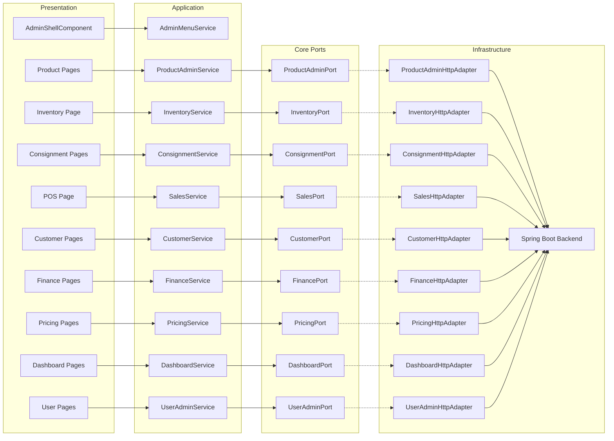
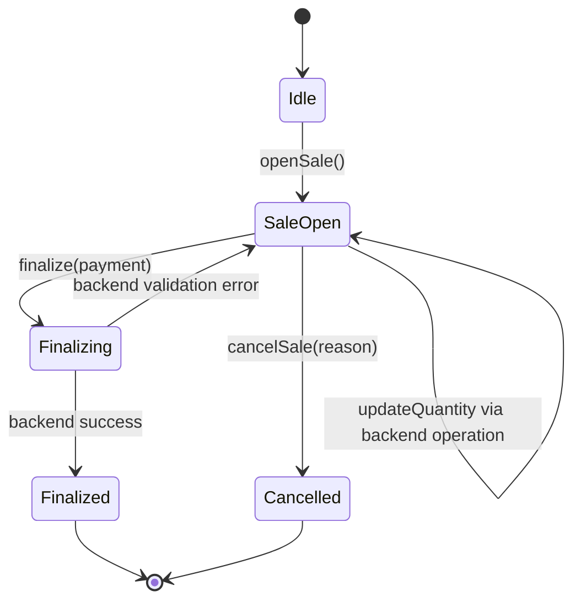
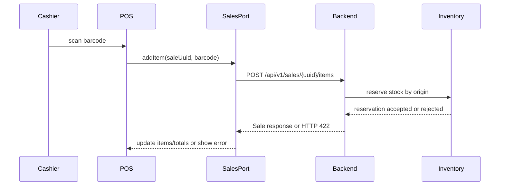

# Design Document: Frontend Administracao do Sistema

## Overview

The Admin System is the protected Angular backoffice for operating the clothing retail ERP. It consolidates existing isolated frontend areas (`dashboard`, `admin/products`, `inventory`, `pos`) into a cohesive administration experience and connects them to backend REST APIs through frontend ports and HTTP adapters.

The design follows the repository rules:

- Angular standalone components with TypeScript strict-friendly code.
- Signals for local feature state and facade services for orchestration.
- Reactive forms for complex data entry and validation.
- HTTP access centralized in infrastructure adapters.
- Backend remains authoritative for authorization, validation, stock, totals, and finance.

## Architecture

### High-Level Routes

```typescript
export const ADMIN_ROUTES: Routes = [
  {
    path: '',
    component: AdminShellComponent,
    canActivate: [authGuard],
    children: [
      { path: 'dashboard', loadComponent: () => import('./dashboard/admin-dashboard.component').then(m => m.AdminDashboardComponent) },
      { path: 'products', loadComponent: () => import('./products/product-list-page.component').then(m => m.ProductListPageComponent) },
      { path: 'products/:uuid', loadComponent: () => import('./products/product-detail-page.component').then(m => m.ProductDetailPageComponent) },
      { path: 'inventory', loadComponent: () => import('./inventory/inventory-page.component').then(m => m.InventoryPageComponent) },
      { path: 'consignments', loadComponent: () => import('./consignments/consignment-list-page.component').then(m => m.ConsignmentListPageComponent) },
      { path: 'consignments/new/received', loadComponent: () => import('./consignments/received-consignment-form.component').then(m => m.ReceivedConsignmentFormComponent) },
      { path: 'consignments/new/sent', loadComponent: () => import('./consignments/sent-consignment-form.component').then(m => m.SentConsignmentFormComponent) },
      { path: 'consignments/:uuid', loadComponent: () => import('./consignments/consignment-detail-page.component').then(m => m.ConsignmentDetailPageComponent) },
      { path: 'pos', loadComponent: () => import('./pos/pos-terminal-page.component').then(m => m.PosTerminalPageComponent) },
      { path: 'customers', loadComponent: () => import('./customers/customer-list-page.component').then(m => m.CustomerListPageComponent) },
      { path: 'finance', loadComponent: () => import('./finance/finance-page.component').then(m => m.FinancePageComponent) },
      { path: 'pricing', loadComponent: () => import('./pricing/pricing-page.component').then(m => m.PricingPageComponent) },
      { path: 'users', loadComponent: () => import('./users/user-list-page.component').then(m => m.UserListPageComponent) },
      { path: '', pathMatch: 'full', redirectTo: 'dashboard' },
    ],
  },
];
```

Role access is enforced in two places:

1. **Frontend route/menu filtering** for usability.
2. **Backend RBAC** for actual security.

### Layer Architecture



## Components and Pages

### AdminShellComponent

| Concern | Design |
|---------|--------|
| Route | Protected admin root |
| Layout | Sidebar, topbar, breadcrumbs, content outlet |
| State | `sidebarOpen`, `currentUser`, `menuItems`, `activeRoute` |
| Dependencies | `AuthService`, `AdminMenuService`, `Router` |
| Behavior | Filters menu by role, supports responsive collapsed navigation, exposes logout |

### AdminDashboardComponent

| Concern | Design |
|---------|--------|
| Route | `/admin/dashboard` or existing `/dashboard` alias |
| Dependencies | `DashboardService` |
| State | `summary`, `loading`, `error` |
| Widgets | Sales today, finalized sales count, average ticket, low stock, finance summary, failed events |

### Product Administration

Pages:

- `ProductListPageComponent`: product table/list, filters, create button.
- `ProductDetailPageComponent`: product form, variants section, images section.
- `VariantFormComponent`: SKU/barcode/size/color/price/cost form.
- Existing image components are reused: `UploadZoneComponent`, `ImageGridComponent`, `ProductImageSectionComponent`.

Backend contracts used:

| Operation | Endpoint |
|-----------|----------|
| List products | `GET /api/v1/products` |
| Get product | `GET /api/v1/products/{uuid}` |
| Create product | `POST /api/v1/products` |
| Update product | `PUT /api/v1/products/{uuid}` |
| Deactivate product | `DELETE /api/v1/products/{uuid}/deactivate` |
| Create variant | `POST /api/v1/products/{uuid}/variants` |
| Image CRUD | `/api/v1/products/{uuid}/images` |

Backend Contract Gaps:

- Product list/detail read models must include variants or variant count where the admin needs them.
- Product summary for storefront must expose min/max prices and image URL.

### Inventory Administration

Components:

- `InventorySearchComponent`: SKU/barcode search.
- `StockSummaryPanelComponent`: physical/reserved/available stock.
- `StockMovementFormComponent`: entry/withdrawal forms.
- `StockMovementHistoryComponent`: movement list.

Backend contracts used:

| Operation | Endpoint |
|-----------|----------|
| Search by SKU | `GET /api/v1/products/variants/by-sku/{sku}` |
| Search by barcode | `GET /api/v1/products/variants/by-barcode/{barcode}` |
| Get stock | `GET /api/v1/inventory/variants/{uuid}/stock` |
| Register entry | `POST /api/v1/inventory/variants/{uuid}/entries` |
| Register withdrawal | `POST /api/v1/inventory/variants/{uuid}/withdrawals` |
| Movement history | `GET /api/v1/inventory/variants/{uuid}/movements` |

When the backend supports origin-aware inventory from `.kiro/specs/consignment-management`, stock summary responses include owned, consigned-in, consigned-out, and origin-specific reserved quantities. The admin UI shows these as an expanded breakdown under the existing physical/reserved/available summary.

### Consignment Administration

Consignment administration follows `.kiro/specs/consignment-management` and covers received and sent consignments.

Pages/components:

- `ConsignmentListPageComponent`: filters by type, status, party, date range, due date, and variant.
- `ConsignmentDetailPageComponent`: item quantities, lifecycle status, audit-facing action history, settlement panel.
- `ReceivedConsignmentFormComponent`: open received consignment.
- `SentConsignmentFormComponent`: open sent consignment.
- `ConsignmentItemTableComponent`: original, sold, purchased, returned, pending quantities.
- `ConsignmentReturnDialogComponent`: return received or sent consignment items.
- `ConsignmentPurchaseDialogComponent`: definitive purchase of received consignment items.
- `SentConsignmentSaleConfirmationDialogComponent`: confirm sale of sent consignment items.
- `ConsignmentSettlementPanelComponent`: pending/paid/received/cancelled settlements.
- `ConsignmentReportsPageComponent`: due/overdue consignments and pending settlements by party.

Backend contracts used:

| Operation | Endpoint |
|-----------|----------|
| Search consignments | `GET /api/v1/consignments` |
| Get detail | `GET /api/v1/consignments/{uuid}` |
| Open received | `POST /api/v1/consignments/received` |
| Open sent | `POST /api/v1/consignments/sent` |
| Return received | `POST /api/v1/consignments/{uuid}/received-returns` |
| Return sent | `POST /api/v1/consignments/{uuid}/sent-returns` |
| Purchase received definitively | `POST /api/v1/consignments/{uuid}/purchase` |
| Confirm sent sale | `POST /api/v1/consignments/{uuid}/sent-sale-confirmations` |
| Mark settlement paid | `POST /api/v1/consignments/{uuid}/settlements/{settlementUuid}/pay` |
| Mark settlement received | `POST /api/v1/consignments/{uuid}/settlements/{settlementUuid}/receive` |
| Due report | `GET /api/v1/consignments/reports/due` |
| Settlement report | `GET /api/v1/consignments/reports/settlements` |

Backend Contract Gaps:

- Consignment backend must be implemented before frontend actions are wired.
- PDV stock allocation policy (`OWNED_FIRST`, `CONSIGNED_IN_FIRST`, or `MANUAL`) must be decided before manual origin selection UI is finalized.
- Fiscal/NF-e behavior remains out of scope for this admin module.

### POS / Vendas Fisicas

The POS is a workflow-oriented feature, not a generic CRUD screen.

State machine:



Components:

- `PosTerminalPageComponent`: smart page and keyboard shortcuts.
- `ProductScanInputComponent`: barcode/SKU input.
- `SaleItemsTableComponent`: reserved sale items.
- `PaymentPanelComponent`: payment method, cash received, total/change display.
- `SaleSummaryPanelComponent`: backend totals and discount summary.
- `CancelSaleDialogComponent`: cancellation reason.

Backend contracts used:

| Operation | Endpoint |
|-----------|----------|
| Open sale | `POST /api/v1/sales` |
| Add item | `POST /api/v1/sales/{uuid}/items` |
| Finalize | `POST /api/v1/sales/{uuid}/finalize` |
| Cancel | `POST /api/v1/sales/{uuid}/cancel` |
| Get sale | `GET /api/v1/sales/{uuid}` |

Backend Contract Gaps:

- Quantity update/removal semantics must be clarified. The current API has add/finalize/cancel but no explicit remove item or change quantity endpoint.
- Payment method enum mapping must be documented exactly.
- Sale item responses must include stock origin when consigned-in stock is used or manual stock-origin selection is enabled.

### Customer Administration

Components:

- `CustomerSearchPageComponent`
- `CustomerFormComponent`
- `CustomerDetailPanelComponent`

Backend contracts used:

| Operation | Endpoint |
|-----------|----------|
| Register | `POST /api/v1/customers` |
| Get | `GET /api/v1/customers/{uuid}` |
| Update | `PUT /api/v1/customers/{uuid}` |
| Deactivate | `DELETE /api/v1/customers/{uuid}/deactivate` |
| Search | `GET /api/v1/customers/search` |

### Finance Administration

Components:

- `CashFlowReportPageComponent`
- `ExpenseFormComponent`
- `FinancialEntryListComponent`

Backend contracts used:

| Operation | Endpoint |
|-----------|----------|
| Register expense | `POST /api/v1/finance/expenses` |
| Cash flow | `GET /api/v1/finance/cash-flow` |
| Entry detail | `GET /api/v1/finance/entries/{uuid}` |

### Pricing Administration

Components:

- `CampaignListComponent`
- `CampaignFormComponent`
- `CouponListComponent`
- `CouponFormComponent`

Backend contracts used:

| Operation | Endpoint |
|-----------|----------|
| Create campaign | `POST /api/v1/pricing/campaigns` |
| List campaigns | `GET /api/v1/pricing/campaigns` |
| Deactivate campaign | `PUT /api/v1/pricing/campaigns/{uuid}/deactivate` |
| Create coupon | `POST /api/v1/pricing/coupons` |

Backend Contract Gaps:

- Listing and updating coupons may need additional endpoints if the admin must manage coupon status after creation.

### User Administration

Components:

- `UserListPageComponent`
- `UserFormComponent`
- `UserRoleSelectComponent`
- `UserStatusActionsComponent`

Backend Contract Gaps:

- User management endpoints are not currently established in the analyzed backend contract. Required endpoints:
  - `GET /api/v1/users`
  - `POST /api/v1/users`
  - `PUT /api/v1/users/{uuid}`
  - `PUT /api/v1/users/{uuid}/role`
  - `PUT /api/v1/users/{uuid}/status`
  - Optional: `POST /api/v1/users/{uuid}/reset-password`

## Frontend Ports

```typescript
export abstract class ProductAdminPort {
  abstract listProducts(filters?: ProductAdminFilters): Observable<ProductAdminSummary[]>;
  abstract getProduct(uuid: string): Observable<ProductAdminDetail>;
  abstract createProduct(command: CreateProductCommand): Observable<ProductAdminDetail>;
  abstract updateProduct(uuid: string, command: UpdateProductCommand): Observable<ProductAdminDetail>;
  abstract deactivateProduct(uuid: string): Observable<void>;
  abstract createVariant(productUuid: string, command: CreateVariantCommand): Observable<VariantDetail>;
}

export abstract class InventoryPort {
  abstract findVariantBySku(sku: string): Observable<VariantDetail>;
  abstract findVariantByBarcode(barcode: string): Observable<VariantDetail>;
  abstract getStock(variantUuid: string): Observable<StockSummary>;
  abstract registerEntry(variantUuid: string, command: StockMovementCommand): Observable<StockSummary>;
  abstract registerWithdrawal(variantUuid: string, command: StockMovementCommand): Observable<StockSummary>;
  abstract listMovements(variantUuid: string): Observable<StockMovement[]>;
}

export abstract class SalesPort {
  abstract openSale(command: OpenSaleCommand): Observable<Sale>;
  abstract addItem(saleUuid: string, command: AddSaleItemCommand): Observable<Sale>;
  abstract finalizeSale(saleUuid: string, command: FinalizeSaleCommand): Observable<Sale>;
  abstract cancelSale(saleUuid: string, command: CancelSaleCommand): Observable<void>;
  abstract getSale(saleUuid: string): Observable<Sale>;
}

export abstract class ConsignmentPort {
  abstract openReceived(command: OpenReceivedConsignmentCommand): Observable<ConsignmentDetail>;
  abstract openSent(command: OpenSentConsignmentCommand): Observable<ConsignmentDetail>;
  abstract search(query: ConsignmentSearchQuery): Observable<Page<ConsignmentSummary>>;
  abstract getByUuid(uuid: string): Observable<ConsignmentDetail>;
  abstract returnReceived(uuid: string, command: ReturnConsignmentCommand): Observable<ConsignmentDetail>;
  abstract returnSent(uuid: string, command: ReturnConsignmentCommand): Observable<ConsignmentDetail>;
  abstract purchaseReceived(uuid: string, command: PurchaseConsignmentCommand): Observable<ConsignmentDetail>;
  abstract confirmSentSale(uuid: string, command: ConfirmSentSaleCommand): Observable<ConsignmentDetail>;
  abstract markSettlementPaid(uuid: string, settlementUuid: string): Observable<ConsignmentSettlement>;
  abstract markSettlementReceived(uuid: string, settlementUuid: string): Observable<ConsignmentSettlement>;
}
```

Equivalent ports are added for `CustomerPort`, `FinancePort`, `PricingPort`, `DashboardPort`, and `UserAdminPort`.

## Role Matrix

| Module | ROLE_MANAGER | ROLE_CASHIER | ROLE_STOCK | ROLE_FINANCE |
|--------|--------------|--------------|------------|--------------|
| Dashboard | Full | POS summary only | Inventory summary only | Finance summary only |
| Products | Read/write | Read/search only | Read/search only | Hidden |
| Product Images | Read/write | Hidden | Hidden | Hidden |
| Inventory | Read/write | Hidden | Read/write | Hidden |
| Consignments | Full | PDV-origin only | Physical actions | View/settle |
| PDV | Full | Full | Hidden | Hidden |
| Customers | Read/write | Read/register/search | Hidden | Hidden |
| Finance | Full | Hidden | Hidden | Full |
| Pricing | Full | Discount calculation only in PDV | Hidden | Hidden |
| Users | Full | Hidden | Hidden | Hidden |

## Data Flow: POS Add Item



## Error Handling

| Scenario | UI Behavior |
|----------|-------------|
| HTTP 401 | Clear session when appropriate and redirect to login with `session_expired` |
| HTTP 403 | Show unauthorized page or inline "Acesso negado" message |
| HTTP 404 | Show not-found state for entity detail pages |
| HTTP 422 | Display field and business validation messages near the form/action |
| Network error | Show retryable error state |
| Backend Contract Gap | Block feature task until API contract is created |

## Correctness Properties

### Property 1: Role menu filtering is sound

For any user role and menu configuration, every visible menu item must include that role in its allowed roles.

### Property 2: Payment method mapping is total

For every frontend payment option (`cash`, `debit`, `credit`, `pix`), mapping to backend enum must produce exactly one supported backend value (`DINHEIRO`, `DEBITO`, `CREDITO`, `PIX`).

### Property 3: Date range validation rejects invalid finance queries

For any date pair where `from > to` or the interval exceeds 366 days, frontend validation must reject submission before calling the port.

### Property 4: Stock quantity validation matches backend range

For any integer quantity outside `[1, 100000]`, stock entry and withdrawal forms must be invalid.

### Property 5: Product form preserves user input after backend validation error

For any product/variant form value submitted to a mocked backend returning HTTP 422, the form values must remain unchanged after error display.

### Property 6: POS displayed total comes from backend sale state

For any sale response returned by `SalesPort`, the POS total shown in the UI must equal the response total field, not a recomputed local value.

### Property 7: Consignment action visibility follows role matrix

For any authenticated role and consignment action, the UI must show the action only when the role matrix allows it. Backend authorization remains authoritative.

### Property 8: Consignment pending quantity display is derived from backend values

For any consignment item response, the pending quantity displayed by the UI must equal the backend-provided pending quantity or, when backend returns only components, `quantity - sold - purchased - returned`.

## Implementation Notes

- Reuse existing admin image components instead of rebuilding image management.
- Replace current local/mock state gradually with ports and adapters.
- Do not introduce NgRx for this MVP; feature facades and signals are sufficient.
- Keep responsive admin UI dense and operational, with tables/forms optimized for daily store use.
- Consignment lifecycle, stock-origin semantics, and settlement behavior are owned by `.kiro/specs/consignment-management`.
- Do not add fiscal/NF-e behavior unless a separate validated fiscal spec is created.
