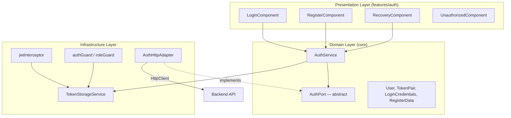
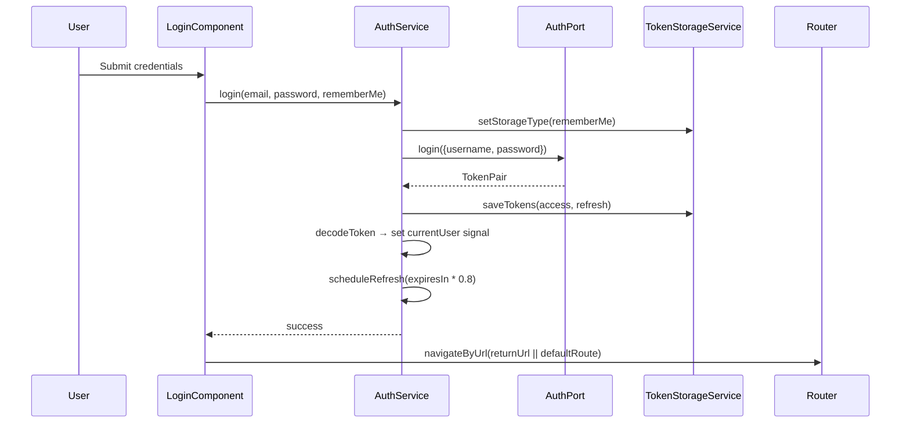

# Design Document: Frontend Auth

## Overview

This design documents the existing frontend authentication system for the "Reino & Flor" Angular storefront. The feature provides a complete auth lifecycle — login, customer self-registration, password recovery, reactive state management via Angular signals, and integration with protected routes. The architecture follows a hexagonal (ports & adapters) pattern where the `AuthPort` abstract class defines the contract and the `AuthHttpAdapter` provides the HTTP implementation.

### Key Design Decisions

1. **Signals over BehaviorSubject**: Auth state uses Angular signals (`signal()` and `computed()`) instead of RxJS subjects for synchronous, glitch-free reactivity in templates.
2. **Hexagonal architecture**: `AuthPort` (abstract class) decouples domain logic from HTTP transport, making `AuthService` testable with mocked ports.
3. **Remember-me via storage strategy**: `TokenStorageService` dynamically switches between `localStorage` (persistent) and `sessionStorage` (tab-scoped) based on user preference.
4. **Proactive token refresh**: The scheduler fires at 80% of `expiresIn`, avoiding expired-token failures.
5. **Generic error messages**: Login errors never reveal whether email or password was wrong; recovery always shows the same message regardless of email existence.

## Architecture



### Component Interaction Flow



## Components and Interfaces

### Presentation Components

| Component | Responsibility |
|-----------|---------------|
| `LoginComponent` | Reactive form (email, password, rememberMe), show/hide password toggle, loading state, error display, returnUrl redirect, session expired message |
| `RegisterComponent` | Reactive form (fullName, email, password, confirmPassword, phone, cpf, termsAccepted), password strength indicator, show/hide toggles for both password fields |
| `RecoveryComponent` | Single email form, generic success message on submit regardless of email existence, link back to login |
| `UnauthorizedComponent` | Static "Acesso não autorizado" message page |

### Domain Services

| Service | Interface |
|---------|-----------|
| `AuthService` | `login(email, password, rememberMe): Observable<void>` · `register(data): Observable<void>` · `logout(): void` · `recoverPassword(email): Observable<void>` · `initFromStorage(): void` · `getDefaultRouteForRole(role): string` |
| Signals: `currentUser: Signal<User \| null>`, `isAuthenticated: Signal<boolean>` (computed), `userRole: Signal<UserRole \| null>` (computed) |

### Infrastructure

| Component | Responsibility |
|-----------|---------------|
| `AuthPort` (abstract) | Defines `login`, `register`, `refresh`, `logout`, `getCurrentUser`, `recoverPassword` contracts |
| `AuthHttpAdapter` | Implements `AuthPort` using Angular `HttpClient` against `/api/v1/auth/*` |
| `TokenStorageService` | Manages access/refresh tokens and role in the selected Storage (session or local) |
| `jwtInterceptor` | Attaches `Authorization: Bearer <token>` to all requests except `/auth/login` and `/auth/refresh` |
| `authGuard` | Redirects unauthenticated users to `/auth/login` |
| `roleGuard` | Redirects users without the required role to `/` |

### Routes

| Path | Component | Guard |
|------|-----------|-------|
| `/auth/login` | `LoginComponent` | — |
| `/auth/register` | `RegisterComponent` | — |
| `/auth/recovery` | `RecoveryComponent` | — |
| `/auth/unauthorized` | `UnauthorizedComponent` | — |

## Data Models

### User

```typescript
interface User {
  uuid: string;
  username: string;
  role: UserRole;
  active: boolean;
}

type UserRole = 'ROLE_MANAGER' | 'ROLE_CASHIER' | 'ROLE_STOCK' | 'ROLE_FINANCE';
```

### TokenPair

```typescript
interface TokenPair {
  accessToken: string;
  refreshToken: string;
  expiresIn: number; // seconds
}
```

### LoginCredentials

```typescript
interface LoginCredentials {
  username: string;
  password: string;
}
```

### RegisterData

```typescript
interface RegisterData {
  fullName: string;
  email: string;
  password: string;
  phone: string;
  cpf?: string;
}
```

### Password Strength Scoring

The `evaluateStrength` function scores a password on 5 criteria (+1 each):
- Length ≥ 8
- Length ≥ 12
- Contains both lowercase and uppercase
- Contains digits
- Contains special characters

Mapping: score ≤ 2 → `weak`, score ≤ 3 → `medium`, score ≥ 4 → `strong`.

### Error Mapping

| HTTP Status | Context | User Message |
|-------------|---------|--------------|
| 0 (network) | Login/Register | "Erro de conexão. Verifique sua internet e tente novamente." |
| 401 | Login | "E-mail ou senha inválidos" |
| 423 | Login | "Conta bloqueada. Tente novamente em X minutos" |
| 429 | Login | "Muitas tentativas. Tente novamente em X minutos" |
| 409 | Register | "Este e-mail já está cadastrado." |
| Other | Any | "Ocorreu um erro inesperado. Tente novamente." |

## Correctness Properties

*A property is a characteristic or behavior that should hold true across all valid executions of a system — essentially, a formal statement about what the system should do. Properties serve as the bridge between human-readable specifications and machine-verifiable correctness guarantees.*

### Property 1: Error mapping preserves dynamic parameters

*For any* positive integer representing minutes (from `remainingMinutes` in a 423 response or `retryAfterMinutes` in a 429 response), the `mapLoginError` function SHALL produce a message string that contains the exact numeric value of the provided minutes.

**Validates: Requirements 1.4, 7.3**

### Property 2: Token storage strategy respects remember-me preference

*For any* pair of non-empty token strings (access, refresh), if `setStorageType(true)` is called before `saveTokens`, then `localStorage` SHALL contain both tokens and `sessionStorage` SHALL NOT; conversely, if `setStorageType(false)` is called, then `sessionStorage` SHALL contain both tokens and `localStorage` SHALL NOT.

**Validates: Requirements 1.6**

### Property 3: Email validation rejects invalid formats

*For any* string that does not conform to a valid email pattern (missing `@`, missing domain, empty string), the Angular email/required validators SHALL mark the control as invalid; and *for any* string that is a well-formed email, the validators SHALL mark the control as valid.

**Validates: Requirements 2.1, 4.2**

### Property 4: Password length validation boundary

*For any* string with length < 8, the password field validator SHALL mark the control as invalid; and *for any* non-empty string with length ≥ 8, the password field validator SHALL mark the control as valid.

**Validates: Requirements 2.2, 3.2**

### Property 5: Passwords match validation

*For any* two strings, if they are not equal then the `passwordsMatchValidator` SHALL return a `passwordMismatch` error; if they are equal and non-empty, the validator SHALL return null (valid).

**Validates: Requirements 3.3**

### Property 6: Password strength classification completeness

*For any* non-empty string, the `evaluateStrength` function SHALL return exactly one of `'weak'`, `'medium'`, or `'strong'`. Furthermore, *for any* string with length < 8 containing only lowercase letters, the result SHALL be `'weak'`; and *for any* string with length ≥ 12 containing lowercase, uppercase, digits, and special characters, the result SHALL be `'strong'`.

**Validates: Requirements 3.4**

### Property 7: Recovery flow never reveals email existence

*For any* email string submitted to the recovery flow, the component SHALL transition to `submitted = true` and display the same generic message, regardless of whether the backend returns success or error.

**Validates: Requirements 4.3**

### Property 8: JWT decode round trip

*For any* valid User object (uuid, username, role, active), encoding it as a JWT payload (base64) and passing it through `decodeToken` SHALL produce a User object with matching uuid, username, role, and active values.

**Validates: Requirements 5.2**

### Property 9: Token refresh scheduled at 80% of expiry

*For any* positive `expiresIn` value (in seconds), the `scheduleRefresh` function SHALL set a timer with delay equal to `expiresIn × 0.8 × 1000` milliseconds.

**Validates: Requirements 5.3**

### Property 10: JWT interceptor excludes auth endpoints

*For any* HTTP request URL, if the URL contains `/auth/login` or `/auth/refresh`, then the `jwtInterceptor` SHALL NOT attach an Authorization header; for all other URLs, if a token is present in storage, the interceptor SHALL attach `Authorization: Bearer <token>`.

**Validates: Requirements 7.5**

## Error Handling

### Network Errors (HTTP Status 0)
- Both login and register flows catch status 0 and display a generic connection error message.
- The user is not logged out or redirected — they stay on the form and can retry.

### Authentication Failures
- **401** — Generic invalid credentials message. No indication of which field is wrong.
- **423** — Account locked with countdown extracted from response body.
- **429** — Rate limit with retry-after duration from response body.
- **409** (register) — Duplicate email message.

### Token Refresh Failure
- When refresh fails (any error from the refresh endpoint or missing refresh token), `handleRefreshFailure` is called:
  1. Clear all stored tokens and role
  2. Cancel any pending refresh timer
  3. Reset `currentUser` signal to null
  4. Navigate to `/auth/login?message=session_expired`
- The login page detects the `session_expired` query param and shows a session expiry banner.

### JWT Decode Failure
- If `decodeToken` throws (malformed JWT), it returns `null`.
- `handleTokens` only updates signals if decode succeeds; otherwise the session remains in its previous state.
- `initFromStorage` calls `clearSession()` if decode fails, forcing re-login.

### Fallback
- Any unexpected HTTP status returns "Ocorreu um erro inesperado. Tente novamente."

## Testing Strategy

### Property-Based Tests (fast-check)

The project uses Angular with TypeScript. Property-based tests will use **fast-check** as the PBT library, integrated with **Jest** (or Jasmine/Karma, matching existing frontend test config).

**Configuration:**
- Minimum 100 iterations per property
- Each test tagged with: `Feature: frontend-auth, Property N: <title>`

| Property | Target Function | Generator Strategy |
|----------|----------------|-------------------|
| 1: Error mapping dynamic params | `mapLoginError` | `fc.nat()` for minutes, combined with status 423/429 |
| 2: Token storage strategy | `TokenStorageService` | `fc.string()` for tokens, `fc.boolean()` for rememberMe |
| 3: Email validation | Angular Validators.email + required | `fc.string()` partitioned by email pattern |
| 4: Password length | Validators.minLength(8) | `fc.string()` with `fc.nat({max: 50})` length |
| 5: Passwords match | `passwordsMatchValidator` | `fc.tuple(fc.string(), fc.string())` |
| 6: Password strength | `evaluateStrength` | `fc.string({minLength: 1})` + targeted generators for each strength band |
| 7: Recovery never reveals | `RecoveryComponent.onSubmit` | `fc.emailAddress()` with success/error backend mock |
| 8: JWT decode round trip | `decodeToken` | `fc.record({uuid, username, role, active})` encoded as JWT |
| 9: Refresh at 80% | `scheduleRefresh` | `fc.integer({min: 1, max: 86400})` |
| 10: Interceptor exclusion | `jwtInterceptor` | `fc.oneof(authUrls, nonAuthUrls)` |

### Unit Tests (Example-Based)

| Component/Service | Scenarios |
|-------------------|-----------|
| `AuthService` | login success → signals updated; logout → signals cleared; initFromStorage with valid/invalid token |
| `LoginComponent` | loading state during request; error display for 401, 423, 429, 0; returnUrl navigation; session_expired banner |
| `RegisterComponent` | terms checkbox required; duplicate email error; successful registration navigates to '/' |
| `RecoveryComponent` | displays success message; shows back-to-login link |
| `authGuard` | redirects when no token; allows when token present |
| `roleGuard` | allows matching role; redirects on role mismatch |

### Integration Tests

| Flow | Scope |
|------|-------|
| Full login flow | Form submit → AuthService → token stored → signals updated → navigation |
| Token refresh cycle | Simulate timer expiry → refresh call → new tokens stored |
| Remember-me persistence | Login with rememberMe → close tab simulation → tokens survive in localStorage |
| Keyboard-only login | Tab through form → Enter to submit (accessibility) |

### Visual / Accessibility

- WCAG 2.1 AA audit: label/input associations, aria-live regions, focus management, contrast ratios
- Responsive snapshot tests at 320px, 768px, 1024px, 1440px viewports
- Font/color compliance verified via computed style assertions or visual regression tools (e.g., Chromatic, Percy)

