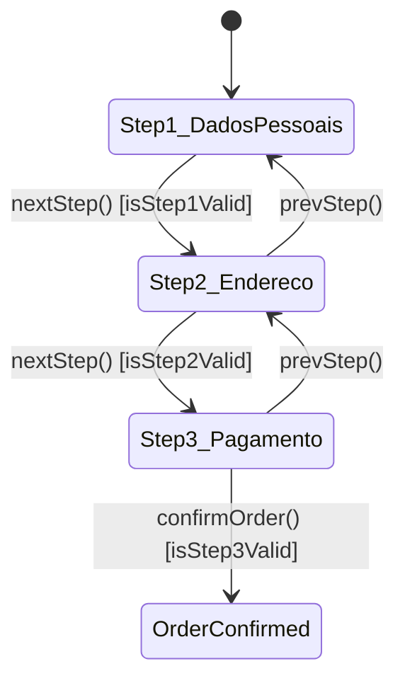

# Frontend Checkout — Design

## Overview

This design describes the cart and checkout experience for the "Reino & Flor" storefront. The feature covers:

1. **Cart page** — displays items with quantity controls, removal, subtotal, and a CTA to proceed.
2. **Multi-step checkout** — a 3-step wizard (Dados Pessoais → Endereço → Pagamento) with form validation and step indicator.
3. **Order summary** — a responsive sidebar/collapsible component showing line items, shipping, and total.
4. **Guest checkout** — no authentication required to complete a purchase.
5. **CartService enhancements** — `updateQuantity`, computed signals for subtotal/shipping/total.

The implementation builds on the existing Angular 21 standalone-component architecture, signals-based reactivity, and hexagonal DI pattern already present in the codebase.

---

## Architecture

```mermaid
graph TD
    subgraph Feature Module - checkout
        A[CartPageComponent] -->|injects| S[CartService]
        B[CheckoutPageComponent] -->|injects| S
        B -->|injects| Auth[AuthService]
        B -->|uses| OS[OrderSummaryComponent]
        A -->|navigates| B
    end

    subgraph Shared State
        S -->|signal| items[items: CartItem[]]
        S -->|computed| subtotal[subtotal]
        S -->|computed| shipping[shippingCost]
        S -->|computed| total[total]
    end

    subgraph Routing
        R[/checkout/cart] --> A
        R2[/checkout] --> B
    end
```

**Key decisions:**

| Decision | Rationale |
|----------|-----------|
| Signals only (no NgRx) | CartService is a simple in-memory store; signals provide fine-grained reactivity without extra dependencies. |
| Standalone components | Project-wide standard since Angular 21. No NgModule overhead. |
| Lazy-loaded route chunk | `/checkout` is a separate lazy chunk—keeps initial bundle small. |
| No auth guard on checkout routes | Guest checkout requirement (4.1). Auth state is read but not enforced. |
| OnPush change detection | All components use `ChangeDetectionStrategy.OnPush` for performance. |

---

## Components and Interfaces

### CartPageComponent

| Concern | Detail |
|---------|--------|
| Selector | `app-cart-page` |
| Route | `/checkout/cart` |
| Inputs | None (reads from CartService signals) |
| Responsibilities | Render item list, quantity +/-, remove, subtotal, CTA, empty state |
| Template sections | Empty state (conditional), item list, subtotal bar, CTA button |

**Template structure:**

```
@if (isEmpty()) {
  <empty-state />
} @else {
  <item-list />
  <subtotal-bar />
  <cta-button />
}
```

### CheckoutPageComponent

| Concern | Detail |
|---------|--------|
| Selector | `app-checkout-page` |
| Route | `/checkout` |
| Responsibilities | Step wizard, form collection, validation, order confirmation |
| Child components | `OrderSummaryComponent` |

**Step state machine:**



### OrderSummaryComponent

| Concern | Detail |
|---------|--------|
| Selector | `app-order-summary` |
| Inputs | `items`, `subtotal`, `shippingCost`, `total` (all required signals via `input.required`) |
| Behavior | Desktop: always visible sidebar. Mobile: collapsible with toggle. |
| State | `collapsed` signal (local) |

### CartService (enhanced)

| Member | Type | Description |
|--------|------|-------------|
| `items` | `signal<CartItem[]>` | Source of truth for cart items |
| `totalItems` | `computed` | Sum of all quantities |
| `subtotal` | `computed` | Σ(price × quantity) |
| `shippingCost` | `computed` | 0 if subtotal ≥ 299, else 15.90 |
| `total` | `computed` | subtotal + shippingCost |
| `addItem(item)` | method | Adds or merges item by variantUuid |
| `updateQuantity(variantUuid, qty)` | method | Sets quantity; removes if qty ≤ 0 |
| `removeItem(variantUuid)` | method | Removes item from cart |
| `clear()` | method | Empties cart |

---

## Data Models

### CartItem (existing)

```typescript
interface CartItem {
  productUuid: string;
  variantUuid: string;
  productName: string;
  size: string;
  color: string;
  price: number;     // unit price in BRL
  quantity: number;  // always ≥ 1
  imageUrl?: string;
}
```

### PersonalData

```typescript
interface PersonalData {
  name: string;
  email: string;
  phone: string;
}
```

### AddressData

```typescript
interface AddressData {
  cep: string;
  street: string;
  number: string;
  complement: string;
  neighborhood: string;
  city: string;
  state: string;
}
```

### PaymentMethod

```typescript
type PaymentMethod = 'pix' | 'credit' | 'debit' | 'cash';
```

### Shipping Rules

```typescript
const FREE_SHIPPING_THRESHOLD = 299;  // BRL
const STANDARD_SHIPPING_COST = 15.90; // BRL
```

---


## Correctness Properties

*A property is a characteristic or behavior that should hold true across all valid executions of a system—essentially, a formal statement about what the system should do. Properties serve as the bridge between human-readable specifications and machine-verifiable correctness guarantees.*

### Property 1: Subtotal equals sum of line totals

*For any* array of CartItems with positive prices and quantities, the computed `subtotal` signal SHALL equal the sum of `price × quantity` for every item in the array.

**Validates: Requirements 1.3, 6.2**

### Property 2: Shipping cost threshold

*For any* cart state, the computed `shippingCost` signal SHALL be `0` when `subtotal >= 299` and `15.90` when `subtotal < 299`.

**Validates: Requirements 3.2, 6.2**

### Property 3: Total is subtotal plus shipping

*For any* cart state, the computed `total` signal SHALL equal `subtotal + shippingCost`.

**Validates: Requirements 6.2**

### Property 4: Remove item decreases cart size and excludes item

*For any* non-empty cart and any item in that cart, calling `removeItem(variantUuid)` SHALL result in the cart having exactly one fewer item, and the removed `variantUuid` SHALL NOT appear in the resulting items array.

**Validates: Requirements 1.2**

### Property 5: updateQuantity changes only the target item

*For any* cart containing an item with a given `variantUuid` and any positive integer `newQty`, calling `updateQuantity(variantUuid, newQty)` SHALL set that item's quantity to `newQty` while leaving all other items unchanged.

**Validates: Requirements 6.1**

---

## Error Handling

| Scenario | Handling |
|----------|----------|
| Empty cart → CTA click | CTA button is hidden when cart is empty (1.5); empty state shown instead. |
| updateQuantity with qty ≤ 0 | CartService.updateQuantity removes the item (defensive: delegates to removeItem). |
| removeItem with non-existent UUID | No-op: `filter` returns the same array. |
| Checkout with empty cart | CheckoutPageComponent should redirect to `/checkout/cart` if items are empty on init. |
| Step validation failure | "Próximo" button is disabled via computed validation signals (isStep1Valid, etc.). User cannot advance without completing required fields. |
| Network failure on order confirm | Future concern (no backend integration in this spec). Show error toast and keep form state intact. |
| AuthService unavailable | Pre-fill gracefully defaults to empty strings via `?.` optional chaining. |

---

## Testing Strategy

### Unit Tests (Vitest)

| Test | Type | Coverage |
|------|------|----------|
| CartPageComponent renders items | Example | 1.1 |
| CartPageComponent shows empty state | Example | 1.5 |
| CartPageComponent CTA navigates to /checkout | Example | 1.4 |
| CheckoutPageComponent step navigation | Example | 2.1, 2.2 |
| CheckoutPageComponent pre-fills auth data | Example | 2.3 |
| CheckoutPageComponent address fields | Example | 2.4 |
| CheckoutPageComponent payment options | Example | 2.5 |
| OrderSummaryComponent renders all data | Example | 3.1 |
| OrderSummaryComponent collapsible on mobile | Example | 3.3 |
| Checkout routes have no auth guard | Smoke | 4.1 |

### Property-Based Tests (Vitest + fast-check)

Library: **fast-check** (JS property-based testing library, integrates with Vitest).

Configuration:
- Minimum 100 iterations per property
- Each test tagged with feature and property reference

| Property Test | Validates | Iterations |
|---------------|-----------|------------|
| Subtotal = Σ(price × qty) | 1.3, 6.2 | 100 |
| Shipping threshold (0 or 15.90) | 3.2, 6.2 | 100 |
| Total = subtotal + shippingCost | 6.2 | 100 |
| removeItem shrinks cart by 1 | 1.2 | 100 |
| updateQuantity targets only one item | 6.1 | 100 |

**Tag format:**
```typescript
// Feature: frontend-checkout, Property 1: Subtotal equals sum of line totals
```

### Responsive / Visual Tests

- Cart page single-column on mobile (5.1) — manual QA or Playwright visual regression.
- Checkout adapts for mobile (5.2) — manual QA or Playwright visual regression.
- Order summary sidebar vs collapsible (3.3) — verified via CSS media queries and manual check.

### Test File Organization

```
features/checkout/
├── cart/
│   ├── cart-page.component.spec.ts          # Unit tests
│   └── cart-page.component.html
├── checkout-page/
│   ├── checkout-page.component.spec.ts      # Unit tests
│   └── checkout-page.component.html
├── components/
│   └── order-summary/
│       └── order-summary.component.spec.ts  # Unit tests
features/storefront/services/
    └── cart.service.spec.ts                  # Property + unit tests
```
