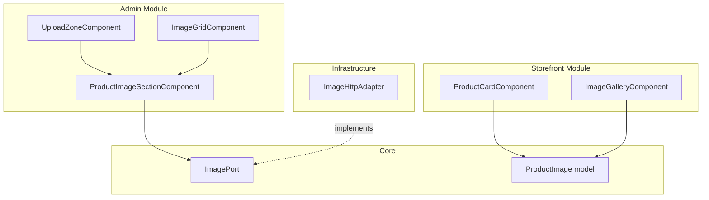

# Design Document: Product Images

## Overview

This design covers the Product Image Management feature, enabling managers to upload, organize, and manage product images through the admin panel, and serving those images to the storefront for catalog and product detail pages.

The feature follows the existing hexagonal architecture pattern in the `product` module with domain models, inbound/outbound ports, application use cases, and web/persistence adapters. Images are stored on the local filesystem with multi-size variant generation (thumbnail 200px, card 400px, full 800px) using the Thumbnailator library. Metadata is persisted in a `produto_imagens` PostgreSQL table with referential integrity to `produtos`.

Key design decisions:
- **Local filesystem storage** with a configurable base path, structured as `/uploads/products/{produto_uuid}/{filename}_{size}.{ext}` for easy future S3 migration
- **Synchronous image processing** during upload (acceptable for ≤10 images, max 5MB each)
- **Thumbnailator** for image resizing (well-maintained, simple API, better than raw ImageIO)
- **Magic bytes validation** for security, independent of Content-Type header
- **Soft invariant enforcement** — the `is_main` uniqueness is enforced at the application layer (not a DB unique constraint, since partial unique indexes on boolean columns have limitations)

## Architecture

```mermaid
graph TB
    subgraph "Adapter In (Web)"
        IC[ProductImageController]
    end

    subgraph "Application"
        UU[UploadImageUseCaseImpl]
        DU[DeleteImageUseCaseImpl]
        RU[ReorderImagesUseCaseImpl]
        MU[SetMainImageUseCaseImpl]
        LU[ListImagesUseCaseImpl]
    end

    subgraph "Domain"
        PI[ProdutoImagem]
        IV[ImageValidator]
    end

    subgraph "Domain Ports In"
        PUI[UploadImageUseCase]
        PDI[DeleteImageUseCase]
        PRI[ReorderImagesUseCase]
        PMI[SetMainImageUseCase]
        PLI[ListImagesUseCase]
    end

    subgraph "Domain Ports Out"
        PIR[ProdutoImagemRepository]
        PIS[ImageStoragePort]
        PIP[ImageProcessorPort]
    end

    subgraph "Adapter Out (Infrastructure)"
        FSA[LocalImageStorageAdapter]
        IPA[ThumbnailatorImageProcessorAdapter]
        JPA[ProdutoImagemJpaRepositoryAdapter]
    end

    IC --> PUI & PDI & PRI & PMI & PLI
    UU -.implements.-> PUI
    DU -.implements.-> PDI
    RU -.implements.-> PRI
    MU -.implements.-> PMI
    LU -.implements.-> PLI
    UU --> PIR & PIS & PIP
    DU --> PIR & PIS
    RU --> PIR
    MU --> PIR
    LU --> PIR
    FSA -.implements.-> PIS
    IPA -.implements.-> PIP
    JPA -.implements.-> PIR
```



### Frontend Architecture



## Components and Interfaces

### Domain Model

```java
// modules/product/src/main/java/br/com/moreiracruz/erp/modules/product/domain/model/ProdutoImagem.java
public class ProdutoImagem {
    private Long id;
    private UUID produtoUuid;
    private String filename;       // sanitized, stored name (e.g., "abc123_thumb.jpg")
    private String originalName;   // original upload name
    private String contentType;    // image/jpeg, image/png, image/webp
    private long fileSize;         // bytes (of original upload)
    private int sortOrder;
    private boolean main;
    private Instant createdAt;

    // Factory method with validation
    public static ProdutoImagem create(UUID produtoUuid, String filename,
            String originalName, String contentType, long fileSize, int sortOrder, boolean main);

    // Restore from persistence (no validation)
    public static ProdutoImagem restore(Long id, UUID produtoUuid, String filename,
            String originalName, String contentType, long fileSize,
            int sortOrder, boolean main, Instant createdAt);
}
```

### Domain Ports (Inbound)

```java
// port/in/UploadImageUseCase.java
public interface UploadImageUseCase {
    List<ImageResponse> upload(UUID produtoUuid, List<UploadImageCommand> files);
}

// port/in/UploadImageCommand.java — record
public record UploadImageCommand(String originalFilename, String contentType, long size, byte[] content) {}

// port/in/DeleteImageUseCase.java
public interface DeleteImageUseCase {
    void delete(UUID produtoUuid, Long imageId);
}

// port/in/ReorderImagesUseCase.java
public interface ReorderImagesUseCase {
    List<ImageResponse> reorder(UUID produtoUuid, List<Long> orderedIds);
}

// port/in/SetMainImageUseCase.java
public interface SetMainImageUseCase {
    ImageResponse setMain(UUID produtoUuid, Long imageId);
}

// port/in/ListImagesUseCase.java
public interface ListImagesUseCase {
    List<ImageResponse> listByProduct(UUID produtoUuid);
}

// port/in/ImageResponse.java — record
public record ImageResponse(
    Long id, String filename, String originalName, String contentType,
    long fileSize, int sortOrder, boolean main, Instant createdAt,
    String thumbnailUrl, String cardUrl, String fullUrl
) {}
```

### Domain Ports (Outbound)

```java
// port/out/ProdutoImagemRepository.java
public interface ProdutoImagemRepository {
    List<ProdutoImagem> findByProdutoUuidOrderBySortOrder(UUID produtoUuid);
    Optional<ProdutoImagem> findByIdAndProdutoUuid(Long id, UUID produtoUuid);
    int countByProdutoUuid(UUID produtoUuid);
    long sumFileSizeByProdutoUuid(UUID produtoUuid);
    int findMaxSortOrderByProdutoUuid(UUID produtoUuid);
    ProdutoImagem save(ProdutoImagem imagem);
    List<ProdutoImagem> saveAll(List<ProdutoImagem> imagens);
    void delete(ProdutoImagem imagem);
    void clearMainByProdutoUuid(UUID produtoUuid);
}

// port/out/ImageStoragePort.java
public interface ImageStoragePort {
    void store(UUID produtoUuid, String filename, byte[] content);
    void delete(UUID produtoUuid, String filename);
    void deleteAll(UUID produtoUuid, List<String> filenames);
    String resolveUrl(UUID produtoUuid, String filename);
}

// port/out/ImageProcessorPort.java
public interface ImageProcessorPort {
    /** Returns map of size-suffix → processed bytes (e.g., "thumb" → bytes, "card" → bytes, "full" → bytes) */
    Map<String, byte[]> resize(byte[] originalContent, String contentType);
}
```

### Web Adapter (Controller)

```java
// adapter/in/web/ProductImageController.java
@RestController
@RequestMapping("/api/v1/products/{uuid}/images")
public class ProductImageController {

    @PostMapping(consumes = MediaType.MULTIPART_FORM_DATA_VALUE)
    @ResponseStatus(HttpStatus.CREATED)
    @PreAuthorize("hasRole('ROLE_MANAGER')")
    public List<ImageResponse> upload(@PathVariable UUID uuid,
                                       @RequestParam("files") List<MultipartFile> files);

    @GetMapping
    public List<ImageResponse> list(@PathVariable UUID uuid);

    @DeleteMapping("/{imageId}")
    @ResponseStatus(HttpStatus.NO_CONTENT)
    @PreAuthorize("hasRole('ROLE_MANAGER')")
    public void delete(@PathVariable UUID uuid, @PathVariable Long imageId);

    @PutMapping("/reorder")
    @PreAuthorize("hasRole('ROLE_MANAGER')")
    public List<ImageResponse> reorder(@PathVariable UUID uuid,
                                        @RequestBody ReorderRequest request);

    @PutMapping("/{imageId}/main")
    @PreAuthorize("hasRole('ROLE_MANAGER')")
    public ImageResponse setMain(@PathVariable UUID uuid, @PathVariable Long imageId);
}
```

### Infrastructure Adapters

**LocalImageStorageAdapter**: Implements `ImageStoragePort` using `java.nio.file.Files`. Configurable base path via `app.images.base-path` property. Creates directories lazily per product UUID.

**ThumbnailatorImageProcessorAdapter**: Implements `ImageProcessorPort` using `net.coobird.thumbnailator.Thumbnails`. Resizes to 3 widths (200, 400, 800) maintaining aspect ratio. JPEG output at 85% quality; PNG/WebP preserved as-is.

**ProdutoImagemJpaRepositoryAdapter**: Implements `ProdutoImagemRepository` using Spring Data JPA with a `ProdutoImagemJpaEntity` and `ProdutoImagemJpaRepository` (Spring Data interface).

### Frontend Components

**Core Model** (`core/models/product-image.model.ts`):
```typescript
export interface ProductImage {
  id: number;
  filename: string;
  originalName: string;
  contentType: string;
  fileSize: number;
  sortOrder: number;
  main: boolean;
  createdAt: string;
  thumbnailUrl: string;
  cardUrl: string;
  fullUrl: string;
}
```

**Core Port** (`core/ports/image.port.ts`):
```typescript
export abstract class ImagePort {
  abstract listByProduct(uuid: string): Observable<ProductImage[]>;
  abstract upload(uuid: string, files: File[]): Observable<ProductImage[]>;
  abstract delete(uuid: string, imageId: number): Observable<void>;
  abstract reorder(uuid: string, imageIds: number[]): Observable<ProductImage[]>;
  abstract setMain(uuid: string, imageId: number): Observable<ProductImage>;
}
```

**Admin Components**:
- `ProductImageSectionComponent` — container component orchestrating upload, grid, and actions
- `UploadZoneComponent` — drag-and-drop zone with client-side validation
- `ImageGridComponent` — thumbnail grid with CDK DragDrop for reorder, star icon for main, delete button

**Storefront Integration**:
- `ProductCardComponent` — already exists, will bind `product.imageUrl` to card-size variant URL (fallback to placeholder)
- `ImageGalleryComponent` — already exists, will receive `ProductImage[]` array and construct URLs from the model

## Data Models

### Database Schema

```sql
-- V10__create_produto_imagens.sql (already exists)
CREATE TABLE produto_imagens (
    id              BIGSERIAL       PRIMARY KEY,
    produto_uuid    UUID            NOT NULL REFERENCES produtos(uuid) ON DELETE CASCADE,
    filename        VARCHAR(255)    NOT NULL,
    original_name   VARCHAR(255)    NOT NULL,
    content_type    VARCHAR(100)    NOT NULL,
    file_size       BIGINT          NOT NULL,
    sort_order      INT             NOT NULL DEFAULT 0,
    is_main         BOOLEAN         NOT NULL DEFAULT FALSE,
    created_at      TIMESTAMPTZ     NOT NULL DEFAULT NOW()
);

CREATE INDEX idx_produto_imagens_produto ON produto_imagens(produto_uuid);
CREATE INDEX idx_produto_imagens_main ON produto_imagens(produto_uuid, is_main) WHERE is_main = TRUE;
```

### JPA Entity

```java
@Entity
@Table(name = "produto_imagens")
public class ProdutoImagemJpaEntity {
    @Id @GeneratedValue(strategy = GenerationType.IDENTITY)
    private Long id;

    @Column(name = "produto_uuid", nullable = false)
    private UUID produtoUuid;

    @Column(nullable = false, length = 255)
    private String filename;

    @Column(name = "original_name", nullable = false, length = 255)
    private String originalName;

    @Column(name = "content_type", nullable = false, length = 100)
    private String contentType;

    @Column(name = "file_size", nullable = false)
    private long fileSize;

    @Column(name = "sort_order", nullable = false)
    private int sortOrder;

    @Column(name = "is_main", nullable = false)
    private boolean main;

    @Column(name = "created_at", nullable = false)
    private Instant createdAt;
}
```

### File Storage Structure

```
/uploads/products/
└── {produto_uuid}/
    ├── {base_name}_thumb.jpg    (200px wide)
    ├── {base_name}_card.jpg     (400px wide)
    ├── {base_name}_full.jpg     (800px wide)
    ├── {base_name2}_thumb.png
    ├── {base_name2}_card.png
    └── {base_name2}_full.png
```

Where `{base_name}` is a UUID-based sanitized filename generated at upload time (e.g., `a1b2c3d4`).

### API Contracts

**POST** `/api/v1/products/{uuid}/images`
- Content-Type: `multipart/form-data`
- Body: `files` — one or more image files
- Response `201`:
```json
[
  {
    "id": 1,
    "filename": "a1b2c3d4",
    "originalName": "vestido_frente.jpg",
    "contentType": "image/jpeg",
    "fileSize": 234567,
    "sortOrder": 0,
    "main": true,
    "createdAt": "2024-01-15T10:30:00Z",
    "thumbnailUrl": "/uploads/products/abc-uuid/a1b2c3d4_thumb.jpg",
    "cardUrl": "/uploads/products/abc-uuid/a1b2c3d4_card.jpg",
    "fullUrl": "/uploads/products/abc-uuid/a1b2c3d4_full.jpg"
  }
]
```

**GET** `/api/v1/products/{uuid}/images`
- Response `200`: Same array structure as above, sorted by `sortOrder` ascending.

**DELETE** `/api/v1/products/{uuid}/images/{imageId}`
- Response `204`: No body.

**PUT** `/api/v1/products/{uuid}/images/reorder`
- Body: `{ "imageIds": [3, 1, 2] }`
- Response `200`: Updated array sorted by new order.

**PUT** `/api/v1/products/{uuid}/images/{imageId}/main`
- Response `200`: Updated `ImageResponse` for the new main image.

### Configuration

```yaml
# application.yml addition
app:
  images:
    base-path: ${APP_IMAGES_BASE_PATH:./uploads/products}
    max-file-size: 5242880        # 5MB in bytes
    max-images-per-product: 10
    max-storage-per-product: 52428800  # 50MB in bytes
    allowed-types:
      - image/jpeg
      - image/png
      - image/webp
    sizes:
      thumbnail: 200
      card: 400
      full: 800
```

## Correctness Properties

*A property is a characteristic or behavior that should hold true across all valid executions of a system — essentially, a formal statement about what the system should do. Properties serve as the bridge between human-readable specifications and machine-verifiable correctness guarantees.*

### Property 1: File type validation rejects non-image content

*For any* byte array whose first bytes do not match JPEG (0xFF 0xD8 0xFF), PNG (0x89 0x50 0x4E 0x47), or WebP (RIFF...WEBP) magic byte signatures, the `ImageValidator.validateMagicBytes()` method SHALL reject the content regardless of the declared Content-Type header.

**Validates: Requirements 1.2, 1.6, 1.7**

### Property 2: File size validation enforces 5MB limit

*For any* file with size in bytes, the upload validation SHALL reject the file if and only if the size exceeds 5,242,880 bytes.

**Validates: Requirements 1.3**

### Property 3: Image count limit enforces maximum of 10

*For any* product with `n` existing images and an upload batch of `k` files, the upload validation SHALL reject the batch if and only if `n + k > 10`.

**Validates: Requirements 1.4**

### Property 4: Storage limit enforces 50MB total per product

*For any* product with existing total storage `s` bytes and an upload batch with total size `t` bytes, the upload validation SHALL reject the batch if and only if `s + t > 52,428,800`.

**Validates: Requirements 1.5**

### Property 5: Filename sanitization removes all dangerous sequences

*For any* string used as a filename, the `sanitizeFilename()` function SHALL produce an output that contains no path separators (`/`, `\`), no parent directory references (`..`), and no null bytes (`\0`).

**Validates: Requirements 1.8, 8.3**

### Property 6: Sort order assignment is sequential after current maximum

*For any* product with current maximum sort_order `m` and a batch upload of `k` images, the newly assigned sort_order values SHALL be `m+1, m+2, ..., m+k` in upload order.

**Validates: Requirements 1.10**

### Property 7: Image resize preserves aspect ratio and produces correct widths

*For any* source image with dimensions `W × H`, the Image_Processor SHALL produce three variants with widths exactly 200, 400, and 800 pixels, each with height `round(target_width * H / W)` (maintaining the original aspect ratio within ±1px rounding tolerance).

**Validates: Requirements 2.1, 2.2**

### Property 8: Non-JPEG format is preserved through resize

*For any* uploaded image with content type `image/png` or `image/webp`, all generated size variants SHALL have the same format as the original.

**Validates: Requirements 2.4**

### Property 9: Storage path construction follows naming convention

*For any* product UUID and base filename, the constructed storage paths SHALL match the pattern `{base-path}/{produto_uuid}/{base_name}_{size_suffix}.{extension}` where size_suffix is one of `thumb`, `card`, `full`.

**Validates: Requirements 2.5**

### Property 10: Image listing is always sorted by sort_order ascending

*For any* product with images, the `listByProduct()` method SHALL return images where for every consecutive pair `(images[i], images[i+1])`, `images[i].sortOrder < images[i+1].sortOrder`.

**Validates: Requirements 3.1**

### Property 11: Main image promotion selects lowest sort_order

*For any* product with more than one image where the current main image is deleted, the image with the lowest sort_order among remaining images SHALL become the new main image.

**Validates: Requirements 4.2**

### Property 12: Reorder maps array positions to sort_order values

*For any* valid permutation of all image IDs for a product, after reorder the image at array position `i` SHALL have `sortOrder == i`.

**Validates: Requirements 5.1**

### Property 13: Reorder rejects incomplete or excessive ID lists

*For any* array of image IDs that is not an exact permutation of all image IDs belonging to the product (missing IDs, extra IDs, or duplicates), the reorder operation SHALL reject with a validation error.

**Validates: Requirements 5.2**

### Property 14: At most one main image per product (uniqueness invariant)

*For any* product and any sequence of operations (upload, delete, set-main, reorder), at most one image SHALL have `is_main = true` at any point in time. If the product has at least one image, exactly one SHALL be main.

**Validates: Requirements 6.1, 12.4**

## Error Handling

| Scenario | HTTP Status | Error Response |
|----------|-------------|----------------|
| File type not accepted (header or magic bytes) | 400 | `{"error": "Tipo de arquivo não aceito", "detail": "Aceitos: JPEG, PNG, WebP"}` |
| File exceeds 5MB | 400 | `{"error": "Arquivo muito grande", "detail": "Tamanho máximo: 5MB"}` |
| Would exceed 10 images | 400 | `{"error": "Limite de imagens excedido", "detail": "Máximo 10 imagens por produto"}` |
| Would exceed 50MB storage | 400 | `{"error": "Limite de armazenamento excedido", "detail": "Máximo 50MB por produto"}` |
| Path traversal detected | 400 | `{"error": "Nome de arquivo inválido"}` |
| Product UUID not found | 404 | `{"error": "Produto não encontrado"}` |
| Image ID not found for product | 404 | `{"error": "Imagem não encontrada"}` |
| Reorder list incomplete/extra | 400 | `{"error": "Lista de IDs inválida", "detail": "Deve conter exatamente todos os IDs de imagens do produto"}` |
| Unauthorized (no token) | 401 | `{"error": "Não autenticado"}` |
| Forbidden (wrong role) | 403 | `{"error": "Acesso negado"}` |
| Image processing failure | 500 | `{"error": "Erro ao processar imagem"}` |
| Filesystem write failure | 500 | `{"error": "Erro ao salvar arquivo"}` |

**Error handling strategy:**
- Validation errors are thrown as `ValidationException` (existing shared exception) and mapped to 400 by `GlobalExceptionHandler`
- Not-found cases throw `NotFoundException` mapped to 404
- Infrastructure failures (I/O) are caught at the use case level, logged with full stack trace, and re-thrown as a generic `ImageProcessingException` mapped to 500
- **Transactional consistency**: If file storage succeeds but DB write fails, the use case catches the exception, attempts to clean up stored files, and re-throws. If cleanup also fails, the orphaned files are logged for manual cleanup.

## Testing Strategy

### Property-Based Tests (jqwik)

The project already uses jqwik (evidenced by `.jqwik-database` in the bootstrap module). Each correctness property maps to a single `@Property` test with minimum 100 iterations.

**Library**: `net.jqwik:jqwik` (already in project)

**Property tests to implement** (one per correctness property above):
- `ImageValidatorProperties` — Properties 1, 2, 3, 4, 5
- `ImageProcessorProperties` — Properties 7, 8
- `ImageStoragePathProperties` — Property 9
- `ImageServiceProperties` — Properties 6, 10, 11, 12, 13, 14

Each test tagged with:
```java
// Feature: product-images, Property 1: File type validation rejects non-image content
@Property(tries = 100)
@Tag("product-images")
```

### Unit Tests (JUnit 5)

- `ProdutoImagem.create()` validation edge cases
- `ImageResponse` DTO mapping
- Controller request/response mapping
- Frontend component rendering (Jasmine/Karma):
  - `UploadZoneComponent`: file type validation, size validation, drag events
  - `ImageGridComponent`: reorder drag-drop, main image toggle
  - `ProductCardComponent`: placeholder fallback, lazy loading attribute
  - `ImageGalleryComponent`: thumbnail click, swipe gesture, preload links

### Integration Tests (Spring Boot Test + Testcontainers)

- `ProductImageUploadIT` — full upload flow (multipart → processing → storage → DB)
- `ProductImageDeleteIT` — delete with main promotion and file cleanup
- `ProductImageSecurityIT` — authorization enforcement for all endpoints
- `ProductImageCascadeDeleteIT` — verify ON DELETE CASCADE removes images when product is deleted
- Static file serving with correct headers

### E2E Tests (Playwright)

- Admin: upload images via drag-and-drop, reorder, set main, delete with confirmation
- Storefront: verify images load in product card and gallery, swipe navigation on mobile viewport
