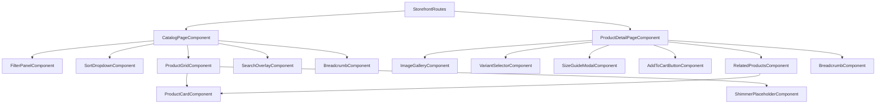
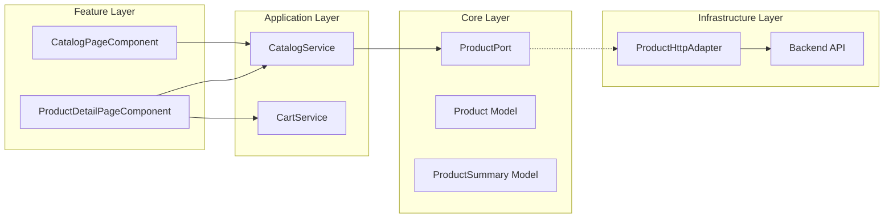
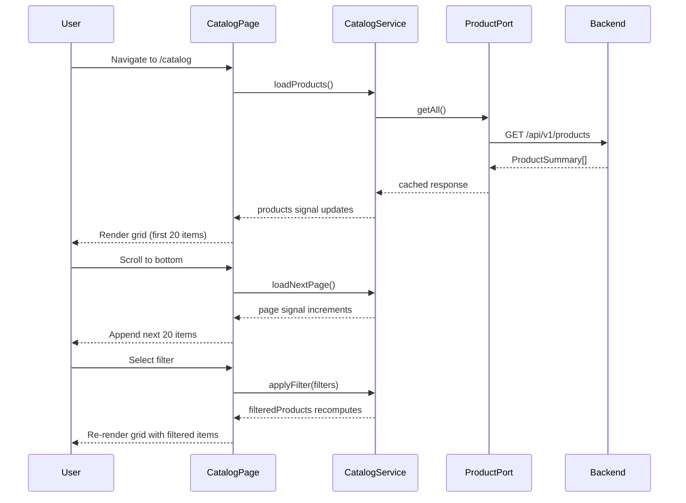
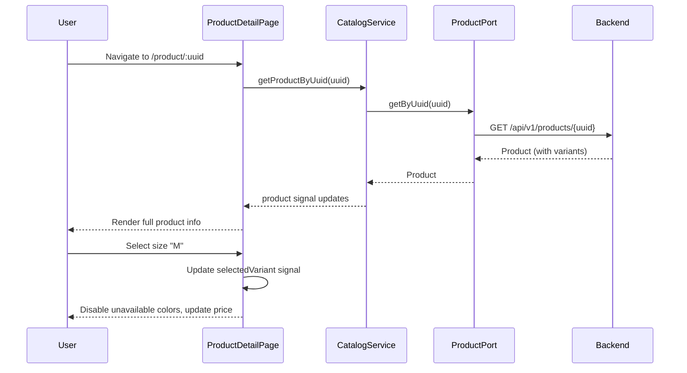

# Design Document: Storefront Catalog

## Overview

The Storefront Catalog feature provides a premium e-commerce browsing experience for the "Reino & Flor" clothing store. It consists of two primary views: a responsive product grid (Catalog Page) and a detailed product view (Product Detail Page). The feature integrates with the existing backend via the hexagonal architecture's `ProductPort`, uses Angular signals for reactive state management, and delivers a mobile-first, WCAG 2.1 AA compliant interface consistent with the established design system.

### Key Design Decisions

1. **Signal-based state management** over NgRx: The catalog's state is local to the feature and doesn't require cross-feature sharing or complex time-travel debugging. Signals provide fine-grained reactivity with less boilerplate.
2. **Facade service pattern** (`CatalogService`): A single service orchestrates filtering, sorting, pagination, and caching logic, keeping smart components thin.
3. **OnPush change detection** everywhere: All components use `ChangeDetectionStrategy.OnPush` paired with signals for optimal rendering performance.
4. **Intersection Observer for infinite scroll**: Native browser API instead of scroll-event polling for better performance.
5. **Client-side filtering/sorting**: Since `ProductPort.getAll()` returns the full list, filtering and sorting happen in-memory via pure transformation functions. This decision assumes the catalog stays under ~5000 products; for larger catalogs, server-side filtering would be needed.

## Architecture

### High-Level Component Tree



### Layer Architecture



### Routing Structure

```typescript
// features/storefront/storefront.routes.ts
export const STOREFRONT_ROUTES: Routes = [
  { path: '', loadComponent: () => import('./home/home.component').then(m => m.HomeComponent) },
  { path: 'catalog', loadComponent: () => import('./catalog/catalog-page.component').then(m => m.CatalogPageComponent) },
  { path: 'product/:uuid', loadComponent: () => import('./product-detail/product-detail-page.component').then(m => m.ProductDetailPageComponent) },
];
```

All storefront routes are public (no auth guard) and lazy-loaded as a single chunk under the root `''` path in `app.routes.ts`.

## Components and Interfaces

### Smart Components (Container)

| Component | Responsibility | Inputs | Key Signals |
|-----------|---------------|--------|-------------|
| `CatalogPageComponent` | Orchestrates catalog grid, filters, sort, search | Route query params | `products`, `loading`, `error`, `hasMore` |
| `ProductDetailPageComponent` | Orchestrates PDP, variant selection, cart | Route param `:uuid` | `product`, `selectedVariant`, `loading`, `error` |

### Presentational Components (Dumb)

| Component | Inputs | Outputs |
|-----------|--------|---------|
| `ProductCardComponent` | `product: ProductSummary` | `(quickView)`, `(navigate)` |
| `ProductGridComponent` | `products: ProductSummary[]`, `loading: boolean` | `(loadMore)` |
| `FilterPanelComponent` | `filters: FilterState`, `counts: FilterCounts` | `(filterChange)` |
| `SortDropdownComponent` | `currentSort: SortOption` | `(sortChange)` |
| `ImageGalleryComponent` | `images: string[]`, `currentIndex: number` | `(imageSelect)` |
| `VariantSelectorComponent` | `variants: Variant[]`, `selected: SelectedVariant` | `(variantChange)` |
| `SizeGuideModalComponent` | `sizes: SizeGuideEntry[]`, `open: boolean` | `(close)` |
| `AddToCartButtonComponent` | `disabled: boolean`, `loading: boolean` | `(addToCart)` |
| `SearchOverlayComponent` | `open: boolean`, `suggestions: ProductSummary[]` | `(search)`, `(close)` |
| `BreadcrumbComponent` | `segments: BreadcrumbSegment[]` | — |
| `ShimmerPlaceholderComponent` | `width: string`, `height: string`, `count: number` | — |
| `RelatedProductsComponent` | `products: ProductSummary[]` | — |

### Services

| Service | Layer | Responsibility |
|---------|-------|----------------|
| `CatalogService` | Application | Product retrieval, filtering, sorting, search, caching, pagination |
| `CartService` | Application | Cart state management, add/remove items |
| `ProductHttpAdapter` | Infrastructure | HTTP calls to `/api/v1/products` endpoints |

### CatalogService Interface

```typescript
@Injectable()
export class CatalogService {
  // State signals
  readonly products = signal<ProductSummary[]>([]);
  readonly filteredProducts = computed<ProductSummary[]>(() => { ... });
  readonly paginatedProducts = computed<ProductSummary[]>(() => { ... });
  readonly loading = signal<boolean>(false);
  readonly error = signal<string | null>(null);
  readonly hasMore = computed<boolean>(() => { ... });
  readonly filters = signal<FilterState>(DEFAULT_FILTERS);
  readonly sort = signal<SortOption>('newest');
  readonly page = signal<number>(0);
  readonly searchResults = signal<ProductSummary[]>([]);

  // Actions
  loadProducts(): void { ... }
  applyFilter(filters: FilterState): void { ... }
  applySort(sort: SortOption): void { ... }
  loadNextPage(): void { ... }
  search(query: string): void { ... }
  getProductByUuid(uuid: string): Observable<Product> { ... }
  retry(): void { ... }
}
```

### Data Flow: Catalog Page



### Data Flow: Product Detail Page



## Data Models

### Domain Models (already defined in `core/models/product.model.ts`)

```typescript
export interface Product {
  uuid: string;
  name: string;
  brand: string;
  category: string;
  active: boolean;
  variants: Variant[];
  createdAt: string;
}

export interface Variant {
  uuid: string;
  sku: string;
  size: string;
  color: string;
  barcode: string;
  price: number;
  cost: number;
  active: boolean;
}

export interface ProductSummary {
  uuid: string;
  name: string;
  brand: string;
  category: string;
  imageUrl?: string;
  minPrice: number;
  maxPrice: number;
}
```

### Feature-Specific Models (new)

```typescript
// Filter state
export interface FilterState {
  categories: string[];
  sizes: string[];
  colors: string[];
  priceRange: { min: number; max: number } | null;
}

export const DEFAULT_FILTERS: FilterState = {
  categories: [],
  sizes: [],
  colors: [],
  priceRange: null,
};

// Sort options
export type SortOption = 'newest' | 'price-asc' | 'price-desc' | 'popularity';

// Filter counts for UI display
export interface FilterCounts {
  categories: Record<string, number>;
  sizes: Record<string, number>;
  colors: Record<string, number>;
}

// Variant selection
export interface SelectedVariant {
  size: string | null;
  color: string | null;
  variant: Variant | null;
}

// Breadcrumb
export interface BreadcrumbSegment {
  label: string;
  path: string | null; // null = current page (no link)
}

// Size guide
export interface SizeGuideEntry {
  size: string;
  bust: string;
  waist: string;
  hips: string;
}

// Search suggestion
export interface SearchSuggestion {
  uuid: string;
  name: string;
  category: string;
  imageUrl?: string;
  minPrice: number;
}

// Cart item
export interface CartItem {
  productUuid: string;
  variantUuid: string;
  productName: string;
  size: string;
  color: string;
  price: number;
  quantity: number;
  imageUrl?: string;
}

// Pagination config
export const PAGE_SIZE = 20;
export const SCROLL_THRESHOLD_PX = 200;
export const CACHE_DURATION_MS = 5 * 60 * 1000; // 5 minutes
export const SEARCH_DEBOUNCE_MS = 300;
export const MIN_SEARCH_LENGTH = 3;
```

### API Integration Layer

```typescript
// infrastructure/http/product-http.adapter.ts
@Injectable({ providedIn: 'root' })
export class ProductHttpAdapter extends ProductPort {
  private readonly baseUrl = `${environment.apiUrl}/api/v1/products`;

  constructor(private http: HttpClient) { super(); }

  getAll(): Observable<ProductSummary[]> {
    return this.http.get<ProductSummary[]>(this.baseUrl);
  }

  getByUuid(uuid: string): Observable<Product> {
    return this.http.get<Product>(`${this.baseUrl}/${uuid}`);
  }

  search(query: string): Observable<ProductSummary[]> {
    return this.http.get<ProductSummary[]>(this.baseUrl, {
      params: { q: query }
    });
  }

  getByCategory(category: string): Observable<ProductSummary[]> {
    return this.http.get<ProductSummary[]>(this.baseUrl, {
      params: { category }
    });
  }
}
```

### Registration in `app.config.ts`

```typescript
{ provide: ProductPort, useClass: ProductHttpAdapter },
```


## Correctness Properties

*A property is a characteristic or behavior that should hold true across all valid executions of a system — essentially, a formal statement about what the system should do. Properties serve as the bridge between human-readable specifications and machine-verifiable correctness guarantees.*

### Property 1: Filter correctness (AND semantics)

*For any* product list and *any* combination of filter values (categories, sizes, colors, price range), the filtered output SHALL contain only products that match ALL active filter criteria simultaneously, and SHALL contain every product from the input that matches all criteria.

**Validates: Requirements 2.2**

### Property 2: Query params round-trip

*For any* valid `FilterState` and `SortOption`, serializing to URL query parameters and then deserializing back SHALL produce an equivalent `FilterState` and `SortOption`.

**Validates: Requirements 2.3, 2.4, 3.4**

### Property 3: Filter counts accuracy

*For any* product list and *any* current active filter state, the count displayed next to each filter option value SHALL equal the number of products that would appear if that single option were toggled on (added to or removed from the current filters).

**Validates: Requirements 2.5**

### Property 4: Clear filters idempotence

*For any* product list, applying `DEFAULT_FILTERS` (all empty) SHALL return the complete unfiltered product list in its original order.

**Validates: Requirements 2.6**

### Property 5: Sort ordering invariant

*For any* non-empty product list and *any* sort option, the sorted output SHALL satisfy the ordering predicate for all adjacent pairs: for `price-asc`, `products[i].minPrice <= products[i+1].minPrice`; for `price-desc`, `products[i].minPrice >= products[i+1].minPrice`; for `newest`, `products[i].createdAt >= products[i+1].createdAt`.

**Validates: Requirements 3.2**

### Property 6: Page reset on filter/sort change

*For any* catalog state where `page > 0`, applying any filter change or sort change SHALL reset `page` to 0.

**Validates: Requirements 4.5**

### Property 7: Breadcrumb segment correctness

*For any* product with a non-empty category and name, the breadcrumb on PDP SHALL produce exactly 3 segments: ["Home", product.category, product.name], and *for any* active category filter on the Catalog Page, the breadcrumb SHALL produce exactly 2 segments: ["Home", activeCategory].

**Validates: Requirements 5.4, 12.1, 12.2**

### Property 8: Related products category constraint

*For any* product and *any* catalog of products, the related products list SHALL contain only products from the same category as the target product, SHALL exclude the target product itself, and SHALL have a length of at most 4.

**Validates: Requirements 5.5**

### Property 9: Variant attribute extraction

*For any* product with one or more active variants, the set of sizes displayed by the Variant_Selector SHALL equal the distinct set of `variant.size` values from all active variants, and the set of colors displayed SHALL equal the distinct set of `variant.color` values from all active variants.

**Validates: Requirements 6.1, 6.2**

### Property 10: Cross-dimension availability

*For any* product variants and *any* selected size, a color SHALL be marked disabled if and only if no active variant exists with that size AND that color. Symmetrically, *for any* selected color, a size SHALL be marked disabled if and only if no active variant exists with that color AND that size.

**Validates: Requirements 6.3, 6.4**

### Property 11: Selected variant price correctness

*For any* product and *any* valid size+color combination that maps to an existing active variant, the displayed price SHALL equal that variant's `price` field.

**Validates: Requirements 6.5**

### Property 12: Default variant selection

*For any* product with at least one active variant, on initial load, the Variant_Selector SHALL pre-select the size and color of the first active variant (ordered as returned by the API).

**Validates: Requirements 6.6**

### Property 13: Search minimum length gate

*For any* input string, the search function SHALL trigger an API call if and only if the trimmed input length is >= 3 characters.

**Validates: Requirements 9.2**

### Property 14: Cache TTL behavior

*For any* sequence of `getAll()` calls, if the elapsed time since the last fresh fetch is less than `CACHE_DURATION_MS`, the service SHALL return the cached data without issuing a new HTTP request. If elapsed time exceeds `CACHE_DURATION_MS`, it SHALL issue a new request.

**Validates: Requirements 10.5**

## Error Handling

### Error Categories

| Error Type | Source | User-Facing Behavior |
|-----------|--------|---------------------|
| Network error | ProductPort HTTP calls | "Não foi possível carregar os produtos. Verifique sua conexão." + Retry button |
| Server error (5xx) | Backend API | "Ocorreu um erro inesperado. Tente novamente." + Retry button |
| Not found (404) | Product UUID not found | "Produto não encontrado." + "Voltar ao catálogo" link |
| Empty results | Valid response, no products | Empty state illustration + "Tente ajustar os filtros" suggestion |
| Image load failure | CDN/image server | Branded fallback placeholder image |
| Search no results | Valid response, empty | "Nenhum resultado para '{query}'. Tente outro termo." |

### Error Handling Strategy

1. **Retry mechanism**: All error states include a retry button that re-invokes the failed operation.
2. **Loading states**: All async operations display shimmer placeholders or loading indicators to prevent layout shift.
3. **Graceful degradation**: Image failures degrade to placeholder; the page remains functional.
4. **Error signal pattern**: `CatalogService` exposes an `error` signal. Components subscribe to it and display contextual error UI.

```typescript
// Error handling in CatalogService
loadProducts(): void {
  this.loading.set(true);
  this.error.set(null);

  this.productPort.getAll().pipe(
    tap(products => {
      this.products.set(products);
      this.cachedAt = Date.now();
    }),
    catchError(err => {
      this.error.set(this.mapError(err));
      return EMPTY;
    }),
    finalize(() => this.loading.set(false))
  ).subscribe();
}

private mapError(err: HttpErrorResponse): string {
  if (err.status === 0) return 'Não foi possível carregar os produtos. Verifique sua conexão.';
  if (err.status === 404) return 'Produto não encontrado.';
  return 'Ocorreu um erro inesperado. Tente novamente.';
}
```

## Testing Strategy

### Unit Tests (Jasmine + Angular TestBed)

Focus on specific examples, edge cases, and component rendering:

- **Components**: Verify rendering of correct data, responsive layout classes, loading/error/empty states
- **Accessibility**: Verify ARIA attributes, semantic landmarks, keyboard interactions
- **Edge cases**: Empty product list, single variant, image load failures, max/min price edge values

### Property-Based Tests (fast-check)

Each correctness property is implemented as a property-based test with minimum 100 iterations per property. The library `fast-check` is used for TypeScript/JavaScript property-based testing.

**Configuration:**
- Library: `fast-check` (npm package)
- Minimum iterations: 100 per property
- Test runner: Jasmine (via Angular CLI)
- Each test tagged with comment: `// Feature: storefront-catalog, Property N: <title>`

**Property tests target pure functions:**
- `filterProducts(products, filters)` → Properties 1, 3, 4
- `sortProducts(products, sortOption)` → Property 5
- `serializeFilters(state) / deserializeFilters(params)` → Property 2
- `computeFilterCounts(products, currentFilters)` → Property 3
- `getAvailableSizes(variants) / getAvailableColors(variants)` → Property 9
- `getDisabledColors(variants, selectedSize) / getDisabledSizes(variants, selectedColor)` → Property 10
- `getVariantPrice(variants, size, color)` → Property 11
- `getDefaultVariant(variants)` → Property 12
- `getRelatedProducts(catalog, product, limit)` → Property 8
- `buildBreadcrumbs(product?, category?)` → Property 7
- `shouldTriggerSearch(input)` → Property 13

### Integration Tests

- CatalogService ↔ ProductPort interaction (mock HTTP backend)
- Router integration (query param sync, navigation)
- IntersectionObserver pagination triggers

### E2E Tests (Playwright or Cypress)

- Full catalog browse flow: load → filter → sort → scroll → product detail
- Search flow: open overlay → type → select suggestion → navigate
- Variant selection → add to cart → confirmation
- Mobile responsive flow: filter toggle, swipe gallery, sticky cart button

### Test File Organization

```
features/storefront/
├── catalog/
│   ├── catalog-page.component.spec.ts         # Unit tests
│   ├── catalog.service.spec.ts                # Unit + integration
│   └── catalog.properties.spec.ts             # Property-based tests (Properties 1-6, 13, 14)
├── product-detail/
│   ├── product-detail-page.component.spec.ts  # Unit tests
│   └── product-detail.properties.spec.ts      # Property-based tests (Properties 7-12)
├── shared/
│   ├── filter-panel.component.spec.ts
│   ├── product-card.component.spec.ts
│   ├── variant-selector.component.spec.ts
│   └── search-overlay.component.spec.ts
└── utils/
    ├── filter.utils.ts                        # Pure functions under property test
    ├── filter.utils.spec.ts
    ├── sort.utils.ts
    ├── sort.utils.spec.ts
    ├── query-params.utils.ts
    ├── query-params.utils.spec.ts
    └── variant.utils.ts
```
